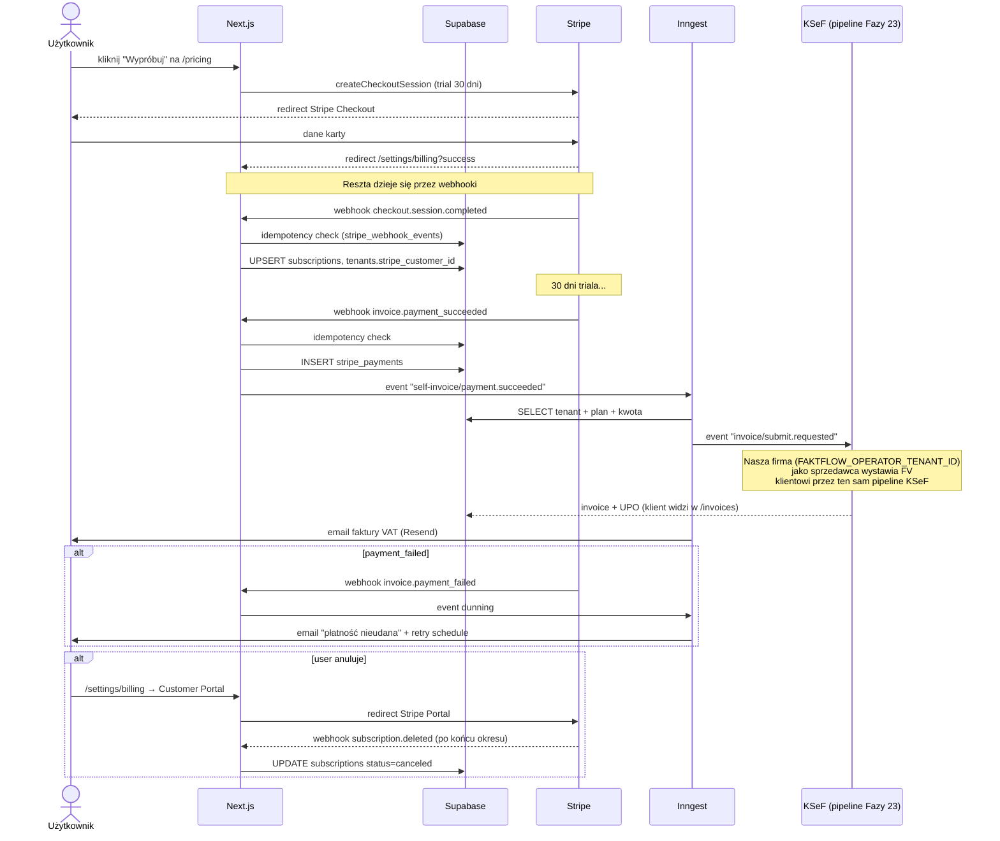

# Billing Flow — Stripe + self-invoicing

Lifecycle subskrypcji: od checkout do faktury VAT, którą **nasza apka** wystawia
sama sobie przez własny pipeline KSeF (meta-rekursja).

## Diagram

## Klucze do zrozumienia

1. **Subscription PER-TENANT, nie per-user.** `tenants.stripe_customer_id` — cała firma płaci jeden plan.
2. **Trial 30 dni** ustawiony przez `subscription_data.trial_period_days: 30` w Checkout. Trial countdown emaile (Faza 25): T-14, T-7, T-3, T-1.
3. **Self-invoicing = my wystawiamy fakturę przez nasz własny pipeline KSeF (Fazy 23).** `FAKTFLOW_OPERATOR_TENANT_ID` env var = nasza firma. Klient dostaje prawdziwą fakturę VAT w `/invoices` jak każdą inną.
4. **Idempotency wszędzie** — `stripe_webhook_events` zapamiętuje `event.id`; każdy webhook re-delivery jest no-op. Bez tego Stripe by zdublował płatności przy retry.
5. **Dunning** = email retry schedule po nieudanej płatności. Stripe próbuje sam 4× przez 3 tygodnie; my dokładamy emaile (Faza 25).
6. **Customer Portal Stripe robi UI** — anulowanie, zmiana karty, faktury historyczne. Nie reimplementujemy.

## Powiązany kod

- `app/api/stripe/webhook/route.ts` — webhook handler (signature verify, idempotency)
- `app/(dashboard)/settings/billing/` — UI subskrypcji + portal redirect
- `app/(dashboard)/settings/billing/actions.ts` — Server Actions
- `lib/inngest/jobs/self-invoice-payment.ts` — emisja FV po opłaconej płatności
- `lib/inngest/jobs/dunning-payment-failed.ts` — emaile po failed payment
- `lib/inngest/jobs/trial-countdown-emails.ts` — trial countdown
- Tabele: `subscriptions`, `stripe_payments`, `stripe_refunds`, `stripe_webhook_events`, `billing_notifications`

## Env vars (zob. [current_state.md](../../.claude/projects/-Users-mokryrys-dev-ksef-saas/memory/current_state.md))

`STRIPE_SECRET_KEY`, `STRIPE_WEBHOOK_SECRET`, `NEXT_PUBLIC_STRIPE_PUBLISHABLE_KEY`,
`STRIPE_PRICE_MONTHLY`, `STRIPE_PRICE_ANNUAL`, `FAKTFLOW_OPERATOR_TENANT_ID`,
`FAKTFLOW_OPERATOR_BANK_ACCOUNT`.
