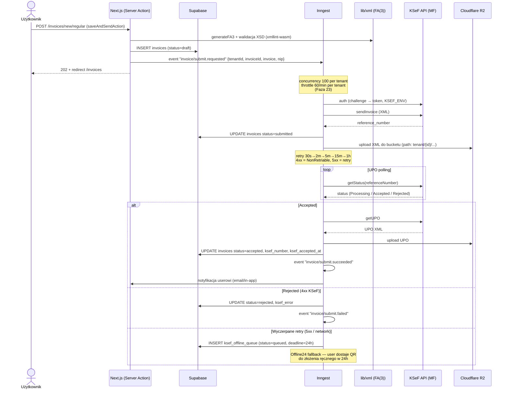

# KSeF Flow — Wysyłka faktury

Pełny lifecycle faktury wychodzącej: od formularza do UPO z KSeF.

## Diagram

## Klucze do zrozumienia

1. **Server Action TYLKO enqueue'uje event** — UI nie czeka na KSeF. To Inngest robi ciężką robotę, retry, throttle.
2. **`KSEF_ENV=test`** w dev/test, **`production`** w prod. Test env NIE waliduje sumy kontrolnej NIP. NIGDY nie używaj prawdziwych NIP w testach.
3. **XML waliduję lokalnie** (`libxmljs2` / `xmllint-wasm`, XSD FA(3)) **PRZED** wysyłką. Lepiej złapać błąd offline niż dostać `400` od KSeF.
4. **UPO osobny krok** — KSeF najpierw zwraca `reference_number`, UPO trafia dopiero po przetworzeniu (sekundy do minut). Stąd polling.
5. **Offline24** — gdy KSeF padnie na > 1h, faktura ląduje w `ksef_offline_queue` z deadline 24h. User dostaje QR. Po powrocie KSeF cron retry'uje (`upoRetryStaleJob`).

## Powiązany kod

- `lib/inngest/jobs/submit-invoice.ts` — główny job
- `lib/inngest/jobs/download-upo.ts` — pobranie UPO
- `lib/inngest/jobs/process-offline-queue.ts` — retry Offline24
- `lib/ksef/` — klient KSeF (auth, submit, status, UPO)
- `lib/xml/fa3-generator.ts` — generator XML FA(3)
- `lib/xml/validator.ts` — walidacja XSD
- Tabele: `invoices`, `ksef_submissions`, `upo_receipts`, `ksef_offline_queue`, `ksef_sessions`, `xml_documents`

## Retry schedule

| Próba | Po jakim czasie | Powód |
|---|---|---|
| 1 | natychmiast | sieć blip |
| 2 | 30 s | krótki incydent KSeF |
| 3 | 2 min | dłuższy incydent |
| 4 | 5 min | utrzymujący się problem |
| 5 | 15 min | poważna awaria |
| 6 (ostatnia) | 1 h | „już dawno powinno wrócić" |
| Po 6 | — | → `ksef_offline_queue` (Offline24) |
