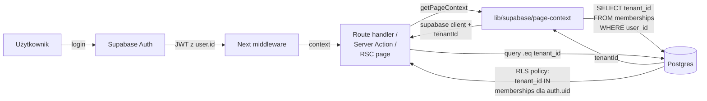

# Multi-tenant + RLS

Jak zapewniamy, że tenant A NIGDY nie zobaczy danych tenanta B — nawet przy
błędzie w kodzie aplikacji.

## Filozofia

**RLS (Row Level Security) jest jedynym źródłem prawdy** dla izolacji
tenantów. Aplikacja może mieć błąd, ale Postgres odmówi wydania cudzego
wiersza, bo polityka RLS sprawdzi `tenant_id` przed każdym SELECT/INSERT/
UPDATE/DELETE.

Klient służby `service_role` (omijający RLS) jest używany **tylko** w:
- Inngest jobs (które same wymuszają `tenant_id` w kodzie)
- Admin endpointach (które są za `ADMIN_EMAILS` allowlistem)

W normalnym kodzie route handlerów i Server Actions **zawsze** używamy klienta
zalogowanej sesji — RLS go pilnuje.

## Diagram



## Jak to wygląda w kodzie

### 1. Server Component / Server Action — KORZYSTA z RLS

```ts
// app/(dashboard)/invoices/page.tsx
import { getPageContext } from '@/lib/supabase/page-context';

export default async function InvoicesPage() {
  const { supabase, tenantId } = await getPageContext();

  // .eq('tenant_id', tenantId) jest tu redundantne (RLS to wymusi),
  // ale dajemy go jako defense-in-depth + żeby planner użył indeksu.
  const { data } = await supabase
    .from('invoices')
    .select('...')
    .eq('tenant_id', tenantId)
    .eq('direction', 'outgoing');

  // RLS odrzuci wiersze obcego tenanta, nawet gdyby .eq wypadło.
}
```

### 2. Inngest job / admin endpoint — OMIJA RLS (service_role)

```ts
// lib/inngest/jobs/submit-invoice.ts
import { createAdminClient } from '@/lib/supabase/admin';

const supabase = createAdminClient(); // service_role — RLS pominięty
const { data } = await supabase
  .from('invoices')
  .select('...')
  .eq('tenant_id', tenantId) // KOD wymusza izolację, bo RLS nie pomoże
  .eq('id', invoiceId)
  .single();
```

⚠️ W kodzie z `createAdminClient()` **musisz pamiętać** o `.eq('tenant_id', ...)`. RLS Cię nie zabezpieczy.

## Wzorzec polityki RLS

Większość tabel z `tenant_id` ma jednolitą politykę (od Fazy 1, dostosowaną w Fazie 14 membership-based):

```sql
CREATE POLICY "tenant_isolation" ON public.invoices
  FOR ALL
  USING (
    tenant_id IN (
      SELECT tenant_id FROM public.memberships
      WHERE user_id = auth.uid()
    )
  )
  WITH CHECK (
    tenant_id IN (
      SELECT tenant_id FROM public.memberships
      WHERE user_id = auth.uid()
    )
  );
```

### Wyjątki

- `audit_logs` — INSERT przez aplikację, **UPDATE/DELETE zablokowane triggerem** (Faza 28, migracja 00052). Immutable z definicji.
- `tenants`, `users` — własne polityki (user widzi tylko swoje tenanty / siebie).
- `accountant_access` — token-based, polityka sprawdza ważność tokenu zamiast `auth.uid()`.
- `support_conversations`, `support_messages` — RLS per-conversation (Faza 30).

## Testy izolacji

`tests/rls-isolation.test.ts` (Vitest) — symuluje 2 tenantów, każdy próbuje
SELECT/UPDATE/DELETE na danych drugiego. Każdy test asercja: zero wierszy / error.
Uruchamiane przez `pnpm test:rls` w CI.

## Co poszłoby NIE TAK gdyby RLS nie było

Wystarczy **jeden** pominięty `.eq('tenant_id', ...)` w jednym route handlerze
żeby tenant A zobaczył listę faktur tenanta B. W app o ~50 routes i ~30
Server Actions — szansa na taki błąd przy najlepszym code review > 0. RLS to
sieć bezpieczeństwa.

## Powiązany kod

- `lib/supabase/server.ts` — klient session-scoped (RLS aktywne)
- `lib/supabase/admin.ts` — klient service_role (RLS pominięte)
- `lib/supabase/page-context.ts` — `getPageContext()` zwraca `{supabase, tenantId, userId}`
- `lib/supabase/middleware.ts` — refresh sesji w middleware
- `tests/rls-isolation.test.ts` — test izolacji
- Migracja `00002_rls_policies.sql`, `00037_rls_membership_based.sql` — definicje polityk
