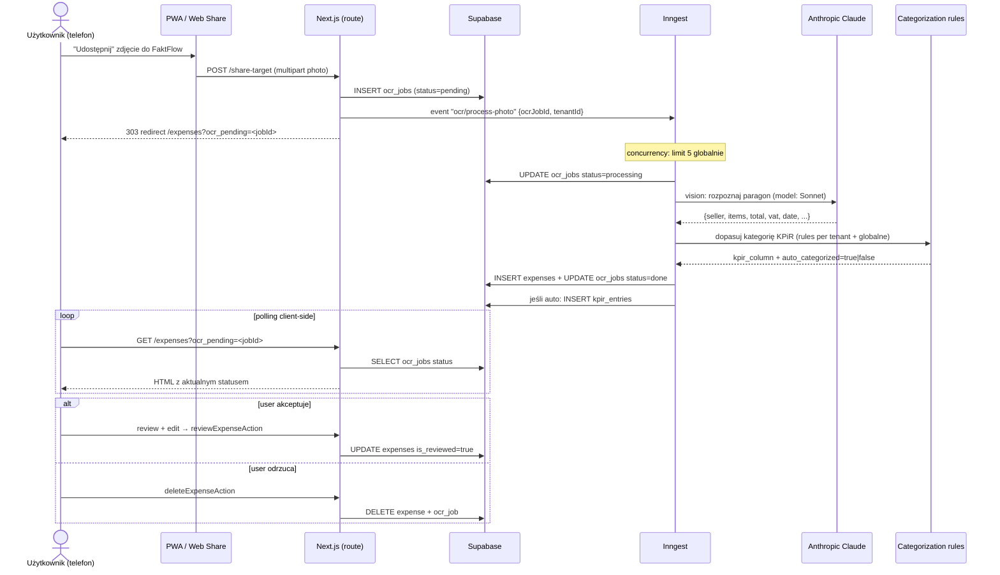

# OCR Flow — Paragon → wpis KPiR

Lifecycle skanowania paragonu: od zdjęcia z telefonu do gotowego wpisu w księdze
przychodów i rozchodów (KPiR).

## Diagram

## Klucze do zrozumienia

1. **Web Share Target = PWA magic.** Telefon traktuje FaktFlow jak natywną apkę: "Udostępnij" w galerii pokazuje FaktFlow. Stąd `app/share-target/route.ts` (real route, nie Server Action).
2. **Status przez polling, nie SSE.** Decyzja udokumentowana w [performance-budget](../performance-budget.md) §8 — Vercel źle znosi long-lived connections.
3. **Globalne concurrency 5** — Claude vision ma limity rate; nie chcemy zalać go 100 zdjęciami naraz. Stress-test (`load:stress:ocr`) sprawdza zachowanie pod 100 concurrent uploaderami.
4. **Categorization rules są dwupoziomowe** — per-tenant (user własne) + globalne (`kpir_global_rules`). Auto-kategoryzacja TYLKO gdy match jest pewny; inaczej user review.
5. **Retencja zdjęć** — oryginalne zdjęcie paragonu jest w `expenses.image_path` (R2), retencja 10 lat (RODO/prawo dokumenty KPiR).

## Powiązany kod

- `app/share-target/route.ts` — przyjmuje multipart photo (jedyny realny POST route do mutacji)
- `app/actions/expenses.ts` — `uploadExpensePhotoAction`, `getOcrJobStatusAction`, `reviewExpenseAction`, `deleteExpenseAction`
- `lib/inngest/jobs/process-ocr.ts` — główny job (concurrency: 5, retries: 2)
- `lib/inngest/jobs/auto-categorize-inbox.ts` — auto-kategoryzacja
- Tabele: `ocr_jobs`, `expenses`, `kpir_entries`, `categorization_rules`, `kpir_global_rules`

## Tryby uploadu

| Tryb | Wejście | Endpoint |
|---|---|---|
| PWA Share Target | "Udostępnij" z galerii | `POST /share-target` |
| Drag & drop / file picker | UI `/expenses` | `uploadExpensePhotoAction` (Server Action) |
| Email forwarding | (planowane post-launch) | — |
