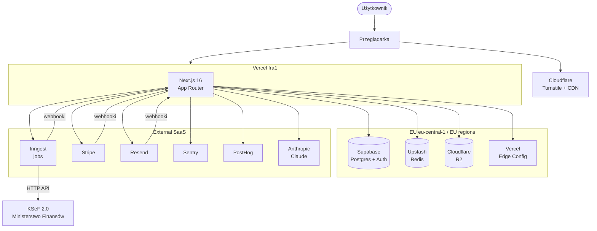

# System Overview (Faza 35)

Wysokopoziomowy obraz wszystkich komponentów KSeF SaaS i jak się ze sobą gadają.
Punkt startowy dla nowego dewa — przeczytaj zanim wskoczysz w kod.

## Komponenty

| Komponent | Rola | Region |
|---|---|---|
| **Next.js 16 (App Router)** | Frontend + RSC + Server Actions + API routes | Vercel `fra1` (Frankfurt) |
| **Supabase Postgres** | Baza, RLS multi-tenant, Auth | `eu-central-1` (Frankfurt) |
| **Inngest** | Background jobs (event-driven, step functions) | Cloud, EU |
| **Cloudflare R2** | XML FA(3) faktur, backupy DB | EU |
| **Upstash Redis** | Cache (TTL/SWR), rate limiting | EU |
| **Vercel Edge Config** | Feature flags globalne | Edge |
| **Cloudflare Turnstile** | Bot protection (login/register/reset) | Edge |
| **Stripe** | Subscriptions, billing, payouts | EU |
| **Resend** | Email transactional + marketing | EU |
| **Sentry** | Errors + performance | Cloud |
| **PostHog Cloud EU** | Analytics + session replay + experimenty | EU |
| **Anthropic Claude** | AI support chat + OCR paragonów | API |
| **KSeF 2.0 (MF)** | Polski rządowy e-Faktury | Polska |

## Diagram

## Klucze do zrozumienia

1. **Vercel ↔ Supabase ten sam region (Frankfurt)** — co-lokacja, latencja DB minimalna. To krytyczne dla p95 < 500 ms (zob. [performance-budget](../performance-budget.md)).
2. **Inngest = pojedyncze źródło background jobs.** Każdy job ma własny event, retry policy, throttle. NIE używamy `setTimeout`/cron w funkcjach Vercela.
3. **R2 vs Supabase storage** — wszystkie XML FA(3) lecą do R2 (tańszy, EU). Avatary/UI assety nie istnieją (nie ma user-generated images poza zdjęciami paragonów, które wychodzą zaraz po OCR).
4. **Redis = cache + rate limiting.** Lookup-aside dla dashboard summary (Faza 22), sliding window dla rate limitów auth (Faza 28).
5. **Wszystko wrażliwe w EU** — RODO + retencja prawna 10 lat dla faktur (zob. [rto-rpo](../security/rto-rpo.md)).

## Pokrewne diagramy

- [KSeF flow](./ksef-flow.md) — pełny lifecycle wysyłki faktury
- [OCR flow](./ocr-flow.md) — od zdjęcia paragonu do wpisu KPiR
- [Billing flow](./billing-flow.md) — Stripe Checkout → subscription → self-invoicing
- [Multi-tenant + RLS](./multi-tenant-rls.md) — jak zapewniamy izolację tenantów
