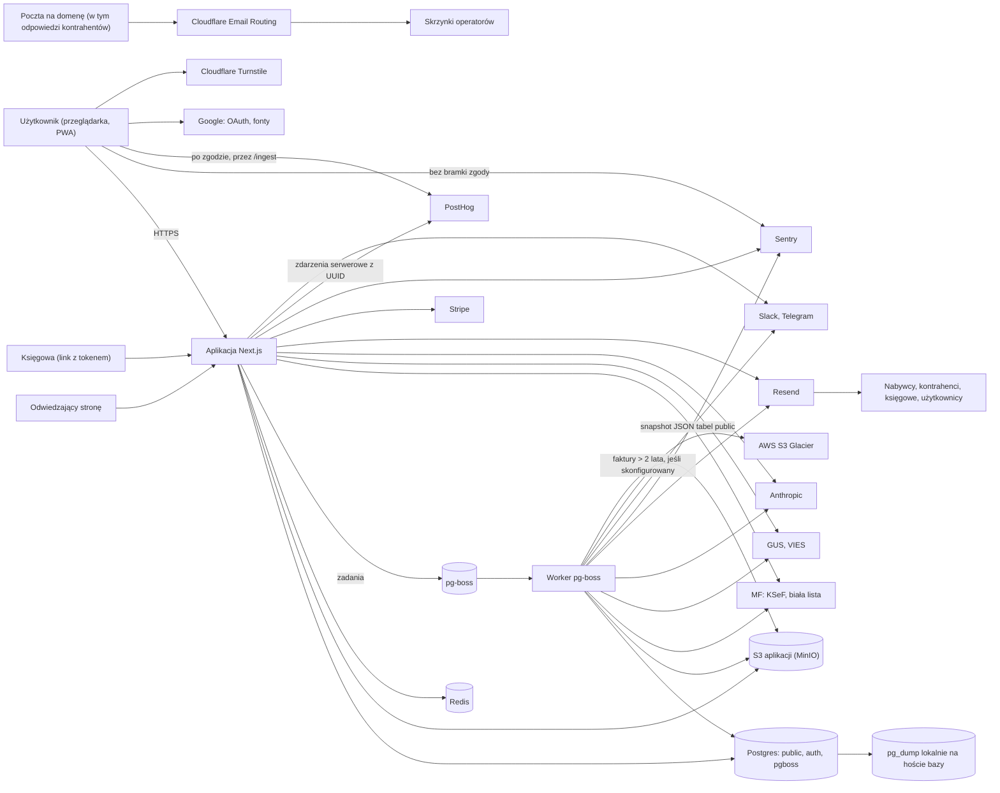
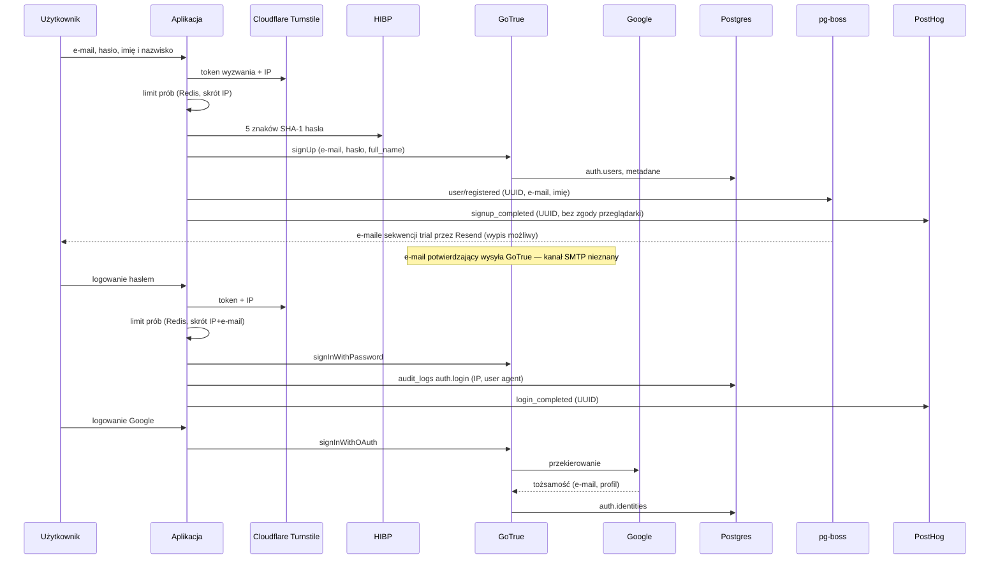
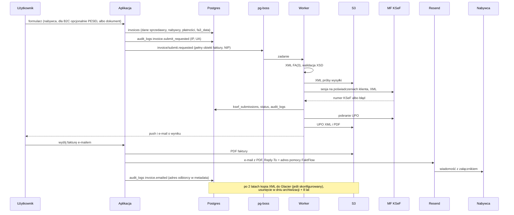
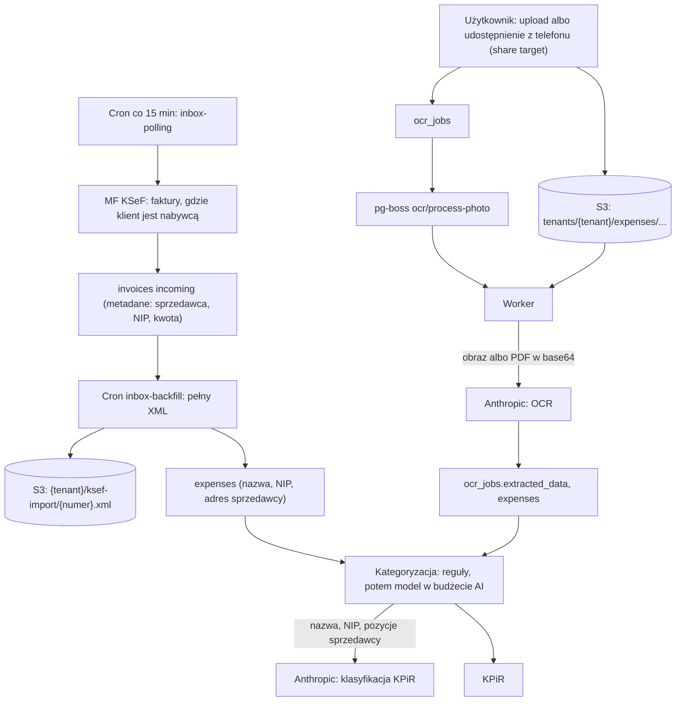
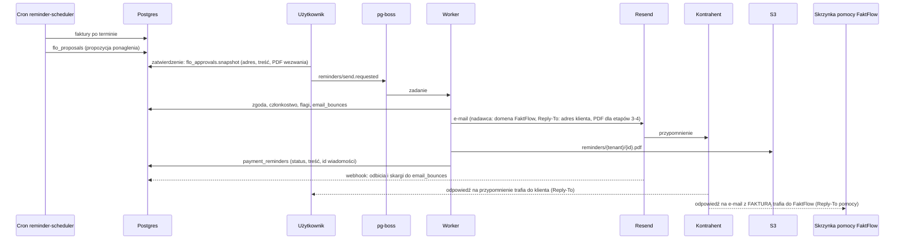
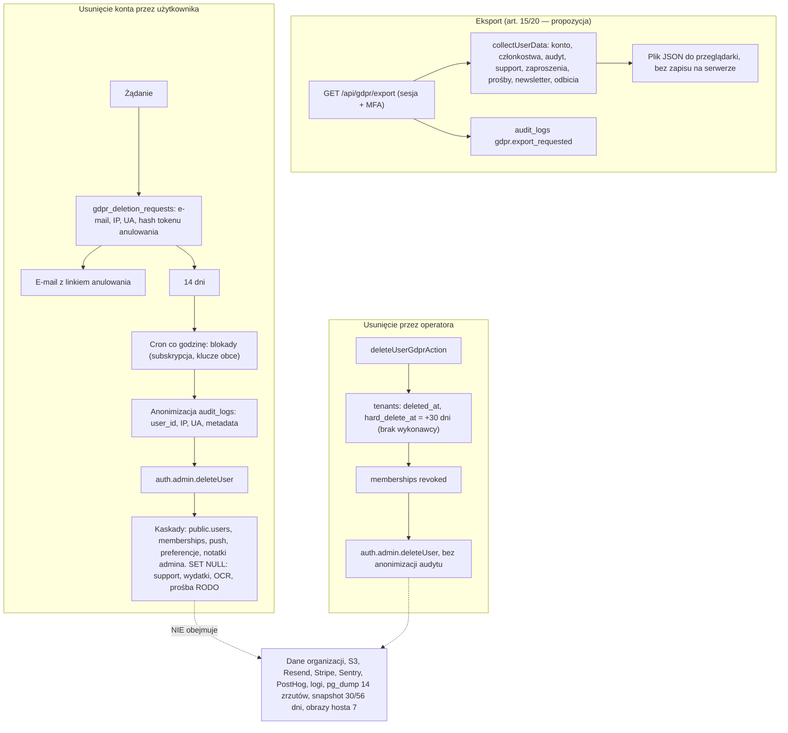
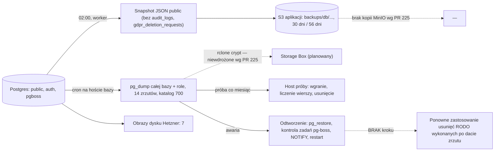

# 02 — Inwentarz danych osobowych, mapa przepływów i role stron

| | |
|---|---|
| Etap | Inwentarz i klasyfikacja (pkt 5.A zadania; wspiera 5.B, 5.E, 5.F) |
| Autor | agent INWENTARZ (subagent koordynatora) |
| Data | 10.10.2026 |
| Wersja kodu | `origin/main` @ `3e5e00d` (gałąź robocza zawiera scalenie tego `main`) |
| Zakres | Kategorie osób i danych, kolumny w bazie, pliki w magazynie S3 (MinIO), `auth.*` GoTrue, Redis, pg-boss, logi, Sentry, PostHog, e-maile (Resend), alerty Slack/Telegram, przeglądarka (storage, service worker, share target), push, `audit_logs`, agent FLO, AI (Anthropic), Stripe, KSeF (MF), rejestry (GUS, biała lista, VIES), kopie zapasowe; role stron osobno dla operacji; mapy przepływów |
| Źródła danych | `supabase/migrations/*.sql` (131 plików, 70 tabel `public`), `types/database.ts`, `lib/**`, `app/**`, `components/**`, `ops/**`, `scripts/hetzner/*`, `next.config.ts`, `instrumentation-client.ts`, `node_modules/pg-boss` (wartości domyślne), ADR 0007/0009, `docs/security/rto-rpo.md`, `docs/runbooks/backup-restore.md`, `docs/runbooks/skrzynka-pomoc.md`; dowód pośredni: PR #225 (niescalony), gałąź `origin/codex/f0-runtime-inventory` @ `686a465`, `docs/observability/{runtime-inventory,data-policy}.md` |
| Ograniczenia | Brak dostępu do produkcji (baza, MinIO, logi kontenerów, konfiguracja GoTrue i Coolify), paneli i umów dostawców. Aplikacji nie uruchamiano. Schemat `auth.*` GoTrue nie jest w repo — opis według wiedzy modelu o GoTrue. Fakty runtime z PR #225 to „pomiar/deklaracja operatora, niezweryfikowane w tej sesji”. Sieć: źródła prawa i dokumentacja dostawców zablokowane (403), WebSearch odrzucony przez właściciela |
| Status | Gotowy do recenzji R1. Autor nie zatwierdza własnego etapu |

**Oznaczenia.**
- **[NZ]** — przepis lub interpretacja przytoczona z pamięci modelu: „niezweryfikowane online 2026-10-10 (egress zablokowany) — treść wg wiedzy modelu, do potwierdzenia w końcowym review”.
- **[PR225]** — „PR #225 (niescalony), gałąź `codex/f0-runtime-inventory` @ `686a465` — pomiar/deklaracja operatora, niezweryfikowane w tej sesji”.
- Klasy: **P** obowiązek prawny, **O** interpretacja organu, **S** kryterium SOC 2, **I** praktyka inżynierska.
- Stany: **potwierdzone / częściowe / brak / niezweryfikowane / nie dotyczy**.
- „Nie znaleziono w repo” ≠ „nie istnieje”. Każde „brak reguły” poniżej znaczy: nie znaleziono w kodzie, migracjach ani skryptach repo; nie wykluczamy ręcznej praktyki operatora.
- Skróty magazynów: **DB** — Postgres na `db-1` (schematy `public`, `auth`, `pgboss`); **S3** — MinIO aplikacji (zmienne `R2_*`; według [PR225] na `ops-1`, nie na `db-1`); **SNAP** — nocny snapshot JSON tabel `public` w S3; **DUMP** — nocny `pg_dump` całej bazy na `db-1`; **HIMG** — obrazy dysku Hetznera `db-1`; **PGB** — tabele zadań pg-boss; **Redis** — lokalny Redis na `app-1` ([PR225]).

## 1. Kategorie osób

| ID | Kategoria osób | Konto? | Gdzie w kodzie (dowód) | Uwagi | Stan |
|---|---|---|---|---|---|
| O-01 | Właściciele i członkowie organizacji (użytkownicy) | tak | `auth.users` (GoTrue), `public.users` (`00001_initial_schema.sql:36-43`), `memberships` (`00036_memberships_invitations.sql:16`) | Role w `memberships`: owner, admin, member, accountant (`00036…sql:21`) | potwierdzone |
| O-02 | Zaproszeni do organizacji i wnioskujący o dołączenie | zaproszony — nie zawsze; wnioskujący — tak | `organization_invitations.email` (`00036…sql:54`), `organization_join_requests.message` (`00036…sql:88`) | Zaproszony bez konta = osoba bez konta z e-mailem w bazie | potwierdzone |
| O-03 | Księgowi z dostępem przez link i odbiorcy paczek (w tym CC) | nie | `accountant_access` (`00001…sql:200-207`, `00010_accountant_access.sql:9-21`), `accountant_settings` (`00024_accountant_copilot.sql:53`), portal `app/accountant/[token]/*`, `app/api/portal/exports/generate/route.ts` | Dostęp tokenem (hash w bazie), odczyt kluczem serwisowym po weryfikacji tokenu (`lib/accountant/load-accountant-portal.ts:16-24,46`) | potwierdzone |
| O-04 | Klienci-przedsiębiorcy będący osobami fizycznymi (JDG): dane „firmy” = dane osobowe | tak (przez O-01) | `tenants` (`00001…sql:14-25` + `00035`, kolumny w `types/database.ts`) | NIP, nazwa i adres JDG identyfikują osobę fizyczną | potwierdzone |
| O-05 | Kontrahenci-nabywcy: firmy, JDG, konsumenci B2C | nie | `contractors` (`00004_phase6_ui.sql:52-63`), `invoices.buyer_*` (`00004…sql:31`, `00012_invoice_types_extension.sql:66-68`) | B2C: PESEL albo numer dowodu/paszportu (`components/invoices/actions.ts:413-427`) | potwierdzone |
| O-06 | Kontrahenci-sprzedawcy z faktur kosztowych (skrzynka KSeF, OCR, import) | nie | `invoices` direction `incoming` (`lib/jobs/runners/inbox-polling.ts:265-330`), `expenses.seller_*` (`00034_expenses_kpir_ocr.sql:46`) | Sprzedawca-JDG = osoba fizyczna | potwierdzone |
| O-07 | Osoby widoczne przypadkiem na dokumentach (np. kasjer na paragonie, osoba w nazwie pozycji, notatce, tytule przelewu) | nie | zdjęcia OCR w S3 (`lib/storage/expenses.ts:66-90`), `invoices.notes`, `kpir_entries.description` | Dane niezamierzone, wolny tekst | częściowe (zakres zależy od treści) |
| O-08 | Płatnicy z importów wyciągów | nie | `payment_imports` (`00014_payments_and_reminders.sql:95-123`), `payments.bank_payer_*` (`00014…sql:57-58`) | W kodzie **nie znaleziono zapisu** do `payment_imports` (jedyny odczyt: `lib/reminders/delivery-safety.ts:146`); domyślny `provider = 'gocardless'` (`00014…sql:99`) | częściowe (schemat bez zasilania) |
| O-09 | Adresaci e-maili z fakturą i przypomnień o płatności | nie | `components/invoices/actions-detail.ts:432-523`, `lib/reminders/prepare-delivery.ts:84-131`, `lib/jobs/runners/send-reminder.ts:19-96` | Adres z formularza albo z danych nabywcy na fakturze | potwierdzone |
| O-10 | Subskrybenci newslettera | nie | `newsletter_subscribers` (`00059_newsletter_subscribers.sql:12-19`), `app/actions/newsletter.ts:39-80` | Kodu wysyłki newslettera nie znaleziono | potwierdzone (zbieranie) |
| O-11 | Nadawcy e-maili na adres pomocy (w tym żądania RODO, odpowiedzi kontrahentów na e-mail z fakturą) | nie | `ops/poczta/worker.mjs:1-12,74`, `lib/site.ts:11`, `lib/email/send.ts:197-200` | **Formularza kontaktowego nie ma**: `/kontakt` to link `mailto:` (`app/(marketing)/kontakt/page.tsx:36`) | potwierdzone (kod), skrzynki docelowe niezweryfikowane |
| O-12 | Rozmówcy czatu supportu AI | tak | `support_conversations`, `support_messages` (`00054_support_conversations.sql:38-63`), `app/api/support/chat/route.ts` | Treść swobodna — może zawierać dane osób trzecich | potwierdzone |
| O-13 | Odwiedzający strony publiczne | nie | `instrumentation-client.ts:5-23`, `lib/analytics/*`, `app/layout.tsx:114-124`, `lib/security/turnstile.ts:33,119` | Telemetria, fonty Google, Turnstile, cookies/localStorage | potwierdzone (kod); runtime — patrz `A4-…` |
| O-14 | Operatorzy i administratorzy platformy | tak | `ADMIN_EMAILS` (`lib/auth/admin-guard.ts:10-16`), `admin_user_notes.author_email` (`00045_admin_panel.sql:25`), `audit_logs.metadata.adminEmail` (`app/admin/users/actions.ts:55,86,201`), bot `ops/bramka` | Operatorzy dostają też raporty e-mail/Telegram | potwierdzone |
| O-15 | Osoba uprawniona do KSeF w imieniu klienta (właściciel certyfikatu/tokenu) | zwykle tak | `tenants.ksef_credentials_encrypted`, `tenants.ksef_authority_user_id` (`00035_organizations_extend.sql:27`) | Treść certyfikatu (np. dane podmiotu w polu subject) zaszyfrowana; zawartości nie badaliśmy | częściowe |
| O-16 | Płatnicy subskrypcji FaktFlow (klienci jako nabywcy usługi) | tak | Stripe Customer (`lib/stripe/customer.ts:90-101`), `subscriptions`, `stripe_payments` (`00047_billing_stripe.sql:68-165`), faktury własne (`lib/jobs/runners/self-invoice-payment.ts:1-21`) | Pokrywa się z O-01/O-04, ale inny cel i inny administrator | potwierdzone |
| O-17 | Osoby z usuniętych kont i organizacji | — | kopie: DUMP, SNAP, HIMG; organizacje po usunięciu konta przez admina (`app/admin/users/actions.ts:149-176`) | Dane trwają w kopiach i w soft-delete | potwierdzone (kod), stan kopii [PR225] |

## 2. Tabela inwentarza

Kolumna „Retencja w kodzie” podaje regułę z plikiem i linią albo „nie znaleziono reguły”. Kolumna „Dostęp” podaje politykę RLS z migracji (RLS jest włączony na wszystkich 70 tabelach `public` — sprawdzone skryptem po `ENABLE ROW LEVEL SECURITY` we wszystkich migracjach) oraz użycie klucza serwisowego.

| ID | Kategoria danych | Osoby | Kolumny / miejsca | Źródło | Cel | Magazyny | Odbiorcy (potwierdzeni w kodzie) | Dostęp | Retencja w kodzie | Dowód |
|---|---|---|---|---|---|---|---|---|---|---|
| D-01 | Dane konta i logowania | O-01, O-14 | `auth.users` (e-mail, hash hasła, `raw_user_meta_data.full_name` z rejestracji), `auth.identities` (Google), czynniki MFA; `public.users.name`, `last_login`, `last_active_tenant_id`; `mfa_recovery_codes.code_hash`, `code_salt` | osoba (formularz), Google OAuth | konto, uwierzytelnienie, bezpieczeństwo | DB, DUMP, HIMG (SNAP bez `auth`) | Google (OAuth), Cloudflare Turnstile (token + IP przy logowaniu, rejestracji, resecie hasła), HIBP (5 znaków SHA-1 hasła), PostHog (UUID, zdarzenia logowania/rejestracji) | `users`: własny wiersz albo wspólna organizacja (`00058`, polityka `users_select_self_or_org_member`); `mfa_recovery_codes`: tylko właściciel (`00050`); admin: `auth.admin.listUsers` (`lib/admin/users.ts:83-131`) | do usunięcia konta (`lib/gdpr/deletion.ts:196`); kody ratunkowe kasowane przy regeneracji (`lib/auth/mfa-recovery.ts:36,118`); nieaktywne konta — nie znaleziono reguły | `app/(auth)/register/actions.ts:21-71`, `app/(auth)/login/actions.ts:97-113`, `lib/security/turnstile.ts:119-124`, `lib/auth/breach-check.ts:34-41` |
| D-02 | Dane aktywności i bezpieczeństwa (IP, user agent, zdarzenia) | O-01, O-14 | `audit_logs.ip_address`, `user_agent`, `metadata`, `action` (`00001…sql:162-172`, `00008_audit_logs_refinements.sql:9`); `gdpr_deletion_requests.user_email`, `ip_address`, `user_agent` (`00051_gdpr_deletion_requests.sql:34-43`); GoTrue: sesje i dziennik audytu (niezweryfikowane) | nagłówki HTTP, akcje | rozliczalność, bezpieczeństwo, obsługa RODO | DB, DUMP, HIMG; `audit_logs` i `gdpr_deletion_requests` **wyłączone** z SNAP (`lib/backup/snapshot-tables.ts:15-20`) | — | `audit_logs`: SELECT dla **każdego członka organizacji** (`00008`, `audit_logs_select_own_tenant`), bez zapisu klienta (`00027_lockdown_audit_xml_writes.sql:25`); `gdpr_deletion_requests`: własne (`00051`) | `audit_logs`: 12 mies., cron 1. dnia miesiąca (`00052_audit_logs_immutable_trigger.sql:53-74`, `lib/jobs/queues.ts:91`); anonimizacja przy usunięciu konta (`00052…sql:95-121`); `gdpr_deletion_requests` — nie znaleziono reguły | `lib/audit/log.ts:4-19,146-160`, `lib/audit/log-system.ts:10-25` |
| D-03 | Dane organizacji klienta (u JDG — dane osobowe) | O-04 | `tenants.name`, `nip`, `regon`, `address_json`, `tax_office_code`, `vat_exemption_basis`, `stripe_customer_id` | osoba, GUS | świadczenie usługi, faktury (Podmiot1) | DB, SNAP, DUMP, HIMG, Redis (`ff:gus:<nip>`) | MF/KSeF (XML), Stripe, GUS (zapytanie NIP), Resend (w treści e-maili), PostHog (UUID organizacji) | członkowie (`00037`, `tenants_select_member_of`); kolumna z poświadczeniami KSeF wyłączona z odczytu klienta (`00112_tenant_credentials_column_privileges.sql`) | soft-delete `deleted_at`/`hard_delete_at` — **brak joba realizującego `hard_delete_at`** (patrz INW-02) | `types/database.ts` (Row `tenants`), `lib/stripe/customer.ts:90-101` |
| D-04 | Poświadczenia i sesje KSeF | O-15 | `tenants.ksef_credentials_encrypted` (AES-256-GCM, klucz z env), `ksef_sessions.session_token_encrypted` | osoba (upload certyfikatu/tokenu) | uwierzytelnienie w KSeF w imieniu klienta | DB, SNAP (zaszyfrowany blob), DUMP, HIMG | MF/KSeF | tylko klucz serwisowy (`00112`) | do usunięcia przez klienta (`ksef.credentials_removed`); brak reguły czasowej | `lib/ksef/credentials-crypto.ts:36,126` |
| D-05 | Członkostwa, zaproszenia, prośby o dołączenie | O-01, O-02 | `memberships`; `organization_invitations.email`, `token_hash`, `role`; `organization_join_requests.message` | owner/admin, wnioskujący | współpraca w organizacji | DB, SNAP, DUMP, HIMG | Resend (e-mail zaproszenia) | członkowie organizacji (`00058`) | nie znaleziono reguły (status `revoked`/`accepted`, wiersze zostają) | `00036_memberships_invitations.sql:16-90` |
| D-06 | Dane księgowej i paczek | O-03 | `accountant_access.accountant_email`, `accountant_name`, `token_hash`, `last_used_at`, `use_count`; `accountant_settings.accountant_email`, `accountant_name`, `accountant_company`, `cc_emails`, szablony e-mail | owner | udostępnienie dokumentów księgowej | DB, SNAP, DUMP, HIMG | Resend (paczki z załącznikami ≤ 25 MB albo linki ważne 7 dni) | owner zarządza (`00037`, `accountant_access_owner_manage`); portal: klucz serwisowy po hashu tokenu | dostęp wygasa (`expires_at`), wiersze zostają — nie znaleziono reguły usuwania | `lib/jobs/runners/co-pilot-monthly.ts:43,486-494,557-579` |
| D-07 | Kontrahenci | O-05, O-06 | `contractors.name`, `nip`, `address`, `email`, `phone`, `bank_accounts_validated`, `vat_status`, `reminder_excluded`, `reminder_exclusion_reason`; `validation_cache.legal_name`, `registered_address`, `bank_accounts`, `raw_response`; Redis `ff:valid:PL:<nip>`, `ff:gus:<nip>`, `ff:list:contractors:<tenant>` | osoba, GUS, biała lista MF, VIES, import, KSeF | wystawianie faktur, weryfikacja kontrahenta | DB, SNAP, DUMP, HIMG, Redis | MF (API białej listy), Komisja Europejska (VIES), GUS — także cyklicznie: kontrahenci bez walidacji > 7 dni (`lib/jobs/runners/nightly-validation-recheck.ts:6-30`) | `contractors`: organizacja (`00004`, `contractors_tenant_isolation`); `validation_cache`: SELECT dla **każdego zalogowanego** (`00022_validation_infrastructure.sql:58-59`, `validation_cache_authenticated_select USING (true)`) | `contractors` — nie znaleziono reguły (usuwanie ręczne, `app/actions/contractors.ts:107`); `validation_cache` 24 h + sprzątanie nocne (`00022…sql:110-125`, `lib/validation/cache.ts:165`); Redis 24 h / 60 s (`lib/cache/keys.ts:18-38`) | `00004_phase6_ui.sql:52-63`, `00022…sql:26,77` |
| D-08 | Treść faktur sprzedażowych | O-04, O-05, O-07 | `invoices.seller_data`, `buyer_data`, `payment_data` (rachunek), `fa3_data`, `buyer_nip`, `notes`, `last_error`; `invoice_line_items.name`; `kpir_entries.description`; `ksef_submissions.error_message`; pliki: XML `{tenant}/{rrrr}/{mm}/{faktura}.xml` + próby, PDF `{tenant}/{rrrr}/{mm}/{faktura}.v…pdf`, UPO `upo/{tenant}/{faktura}.xml|pdf` | osoba (formularz), import | wystawienie i przechowanie faktury | DB, S3, SNAP, DUMP, HIMG, PGB (payload `invoice/submit.requested`), AWS S3 Glacier (kod: faktury > 2 lata) | MF/KSeF, nabywca (e-mail z PDF przez Resend), księgowa (portal, paczki), Anthropic — nie (tylko faktury kosztowe) | organizacja (`00002`, `invoices_*_own_tenant`) | archiwizacja po 2 latach i usunięcie w dniu archiwizacji + 8 lat, z plikami (`lib/jobs/runners/archive-old-invoices.ts:22,100`, `lib/jobs/runners/retention-delete.ts:31-80`, `lib/retention/invoice-files.ts:31-70`) | `lib/storage/r2.ts:51-103`, `lib/pdf/pdf-storage.ts:39-50`, `lib/ksef/upo-storage.ts:7-12`, `lib/jobs/events.ts:59-80` |
| D-09 | Identyfikatory nabywców B2C | O-05 (konsumenci) | `invoices.buyer_pesel`, `buyer_id_number` (dowód/paszport), `buyer_id_type`; w `fa3_data`, XML (`NrID`) | osoba (formularz), import | identyfikacja nabywcy na fakturze (opcjonalnie; domyślnie „brak ID”) | jak D-08 | MF/KSeF (`KodKraju`+`NrID`) | jak D-08 — widoczne dla wszystkich członków organizacji | jak D-08 | `00012…sql:66-68`, `lib/xml/fa3-generator.ts:311-317`, `lib/ksef/fa3-advance-generator.ts:278-281`; PDF nie drukuje PESEL (brak trafień w `lib/pdf`) |
| D-10 | Faktury kosztowe ze skrzynki KSeF | O-06 | `invoices` (`direction='incoming'`, `fa3_data`), `expenses.seller_name`, `seller_nip`, `seller_address`, `notes`; XML `{tenant}/ksef-import/{numer}.xml`; `categorization_rules.match_value` | KSeF (MF), import historii | KPiR, koszty, kategoryzacja | DB, S3, SNAP, DUMP, HIMG, PGB (`inbox/invoice.received`: nazwa i NIP sprzedawcy) | Anthropic (nazwa, NIP, pozycje — klasyfikacja KPiR w budżecie AI) | organizacja (`00034`, `expenses_*_own_tenant`) | faktura jak D-08; `expenses`, `categorization_rules` — nie znaleziono reguły | `lib/jobs/runners/inbox-polling.ts:265-330`, `lib/import/ksef-xml-archive.ts:29-35,57-63`, `lib/categorization/ai-classifier.ts:42-50`, `lib/categorization/index.ts:69-74`, `lib/jobs/events.ts:149-157` |
| D-11 | Dokumenty i zdjęcia OCR | O-06, O-07 | S3 `tenants/{tenant}/expenses/{rrrr}/{mm}/{ocrJob}.{ext}`; `ocr_jobs.extracted_data`, `source_file_path`; `expenses.ocr_extracted_data` | osoba (upload, PWA share target) | rozpoznanie dokumentu, koszt | S3, DB, SNAP, DUMP, HIMG | Anthropic (obraz/PDF w base64) | organizacja (`00034`, `ocr_jobs_*_own_tenant`) | nie znaleziono reguły (pliki kasowane tylko przy nieudanym zapisie: `app/actions/expenses.ts:171,185`) | `lib/storage/expenses.ts:66-90`, `lib/ocr/engine.ts:144-158`, `app/share-target/route.ts:19-45` |
| D-12 | Płatności i dane z wyciągów | O-05, O-08 | `payments.bank_payer_name`, `bank_payer_account`, `notes`; `payment_imports.counterparty_name`, `counterparty_account`, `counterparty_nip`, `title`, `account_iban` | ręcznie, FLO (`payment.confirm`); `payment_imports` — brak zasilania w kodzie | rozliczenie faktur | DB, SNAP, DUMP, HIMG | — | SELECT organizacji (`00074`) | kaskadowo z fakturą (`00014…sql:49,143`); `payment_imports` — nie znaleziono reguły | `00014…sql:46-123`, `lib/flo/functions/payment-confirm.ts:343,427` |
| D-13 | Przypomnienia o płatności do kontrahentów | O-09, O-04 | `payment_reminders.email_subject`, `email_body`, `pdf_attachment_path`, `status`; `reminder_settings.sender_name`, `sender_email`, `reply_to_email`; `reminder_templates`; `flo_approvals.snapshot.reminderDispatch` (adres, temat, treść, PDF wezwania w base64); S3 `reminders/{tenant}/{id}.pdf` | system (propozycja FLO) + kliknięcie użytkownika | windykacja w imieniu klienta | DB, S3, SNAP, DUMP, HIMG | Resend → kontrahent (Reply-To = adres klienta) | SELECT organizacji (`00074`) | PDF i wiersze z fakturą (`lib/retention/invoice-files.ts:64-66`, kaskada `00014…sql:143`); `flo_approvals` — nie znaleziono reguły | `lib/reminders/prepare-delivery.ts:75-131`, `lib/reminders/delivery-consent.ts:76`, `lib/reminders/delivery-schema.ts:31-53`, `lib/jobs/runners/send-reminder.ts:75-96` |
| D-14 | Eksporty i paczki księgowe | O-03, O-05, O-06 | `export_jobs.emailed_to`, `triggered_by`; `export_files.r2_path`, `last_downloaded_by`; S3 `exports/{tenant}/{job}/{plik}` (JPK, KPiR, CSV, XLSX, ZIP) | system | przekazanie księgowej, archiwum | S3, DB, SNAP, DUMP, HIMG | Resend (załącznik albo link 7 dni), księgowa | organizacja (`00024`) | **komentarz „pliki usuwane po 90 dniach” bez implementacji** (`00024…sql:211`); nie znaleziono reguły | `lib/jobs/runners/exports-generate.ts:231,432` |
| D-15 | Importy plików | O-05, O-06 | S3 `imports/{tenant}/{job}/{nazwa}` (nazwa pliku w kluczu); `import_jobs.source_filename`, `warnings` | osoba (upload JPK_FA/CSV) | migracja historii faktur | S3, DB, SNAP, DUMP, HIMG | — | organizacja (`00019`) | opis „tymczasowe” bez usuwania — nie znaleziono reguły | `lib/import/file-storage.ts:1-27`, `00020_import_jobs_pending_metadata.sql:18` |
| D-16 | Rozmowy z supportem AI | O-12 (+ osoby trzecie w treści) | `support_messages.content`, `support_conversations.subject`, `csat_comment`, `escalation_reason` | osoba (czat) | pomoc techniczna | DB, SNAP, DUMP, HIMG | Anthropic (do 20 ostatnich tur + baza wiedzy), Slack (#bugs: identyfikator rozmowy; **e-mail użytkownika przy eskalacji**) | tylko autor (`00054`, `support_conv_own_select`); zapis tylko serwer | nie znaleziono reguły | `app/api/support/chat/route.ts:45,105-139,176-185`, `lib/support/chat.ts:79-82`, `lib/support/support-actions.ts:41-83` |
| D-17 | Preferencje i zdarzenia poczty | O-01, O-05, O-09 | `email_preferences`; `email_bounces.email`, `bounce_type`, `reason` (`raw_payload` = NULL od AUD-81); `billing_notifications.recipient_email`, `resend_message_id` | Resend (webhook), użytkownik | dostarczalność, wypis | DB, SNAP, DUMP, HIMG | Resend | `email_preferences`: własne (`00049`); `email_bounces`, `billing_notifications`: brak polityk (tylko serwer) | nie znaleziono reguły | `00049_email_infrastructure.sql:39-120`, `app/api/email/resend-webhook/route.ts:162,206,292`, `00113_user_deletion_foreign_keys.sql` (czyszczenie starych payloadów) |
| D-18 | Newsletter | O-10 | `newsletter_subscribers.email`, `source`, `created_at`, `unsubscribed_at` | formularz bloga (IP tylko do limitu prób, hash) | marketing (planowany) | DB, SNAP, DUMP, HIMG | — (kodu wysyłki nie znaleziono) | brak polityk = tylko serwer | nie znaleziono reguły; `unsubscribed_at` nie jest nigdzie ustawiane | `00059…sql:12-19`, `app/actions/newsletter.ts:39-80` |
| D-19 | Subskrypcje push | O-01 | `push_subscriptions.endpoint`, `p256dh`, `auth`, `user_agent`, `device_name` | przeglądarka | powiadomienia | DB, SNAP, DUMP, HIMG | usługa push producenta przeglądarki (treść szyfrowana: numer faktury, krótki opis błędu) | własne (`00032`) | dezaktywacja po błędzie (`lib/push/sender.ts:128`); nie znaleziono usuwania | `00032_push_subscriptions.sql:7-25`, `lib/jobs/runners/notify-user.ts:142-143,429-430` |
| D-20 | Billing FaktFlow (subskrypcje) | O-16, O-04 | Stripe Customer: e-mail, nazwa, NIP (`description`, `metadata`, `tax_id_data`); `subscriptions.last_webhook_payload`; `stripe_payments.last_webhook_payload` (pełny obiekt faktury Stripe); `stripe_webhook_events.payload`; faktury własne w organizacji operatora (`invoices`) | Stripe, aplikacja | rozliczenie usługi, faktury VAT FaktFlow | DB, SNAP, DUMP, HIMG, Stripe | Stripe, MF/KSeF (faktura własna), Resend (e-maile billingowe), PostHog (zdarzenia billingowe z UUID) | `subscriptions`: SELECT organizacji (`00047`); zdarzenia Stripe — tylko serwer | `stripe_webhook_events.payload` przycinany po 90 dniach od przetworzenia (`00109_stripe_webhook_retention.sql:102-110`, `lib/jobs/runners/cleanup-audit-logs.ts:64-81`); `last_webhook_payload` — nie znaleziono reguły | `lib/stripe/event-mapping.ts:446`, `lib/jobs/runners/self-invoice-payment.ts:1-21,86,158` |
| D-21 | Notatki i działania operatorów | O-14, O-01 | `admin_user_notes.body`, `author_email`; `audit_logs.metadata.adminEmail`; `global_feature_flags.updated_by` | operator | obsługa klienta, nadzór | DB, SNAP, DUMP, HIMG | — | brak polityk (tylko serwer + `requireAdmin` z MFA) | `archived_at` — nie znaleziono usuwania | `00045_admin_panel.sql:16-27`, `lib/auth/admin-guard.ts:31-48` |
| D-22 | Agent FLO | O-04, O-05, O-06, O-09 | `flo_proposals.title`, `body`, `payload`, `evidence`; `flo_approvals.snapshot`; `flo_shadow.proposal`, `actual`; `flo_prefs.tax_profile`; `flo_decisions`, `flo_usage` | cron `flo-tick` (07:30), akcje użytkownika | propozycje działań (potwierdzenie wpłaty, brakujące dokumenty, ponaglenie) | DB, SNAP, DUMP, HIMG | Resend (wykonanie ponaglenia); model językowy FLO **nieaktywny** | SELECT organizacji (`00061`) | wygaszanie = zmiana statusu (`lib/flo/proposals.ts:251-260`); nie znaleziono usuwania | `lib/jobs/queues.ts:100-104`, `lib/flo/kind-switch.ts:16-26`, `tests/unit/flo-nieaktywne.test.ts:24-42` |
| D-23 | Telemetria błędów (Sentry) | O-01, O-13 | zdarzenia błędów, transakcje (10% przeglądarka/serwer, 0% worker), `user.id` (po filtrze), tagi | aplikacja, przeglądarka (przez `/monitoring`) | diagnostyka | Sentry (intake EU wg [PR225]) | Sentry | — | po stronie dostawcy — nieodczytana ([PR225]) | `lib/observability/scrub.ts:4-79`, `sentry.server.config.ts:4-12`, `instrumentation-client.ts:5-20`, `lib/jobs/sentry.ts:23-37`, `next.config.ts:189` |
| D-24 | Analityka produktowa (PostHog) | O-01, O-13 | przeglądarka: zdarzenia z listy dozwolonych, `distinct_id` = UUID użytkownika, grupa `tenant` = UUID organizacji, URL sprowadzony do obszaru; serwer: logowanie, rejestracja, zdarzenia Stripe, wysyłka faktury z UUID | przeglądarka (po zgodzie), serwer (bez bramki zgody) | analityka produktu | PostHog (intake EU wg [PR225]) | PostHog (przez `/ingest` z przeglądarki, bezpośrednio z serwera) | — | po stronie dostawcy: 1 rok ([PR225]) | `lib/analytics/init-posthog-browser.ts:13-61`, `lib/analytics/privacy.ts:6-123`, `lib/analytics/server.ts:7-55`, `components/analytics/analytics-identify.tsx:13-20`, `next.config.ts:138-157` |
| D-25 | Logi aplikacji i workera | O-01, O-04 (zamaskowane) | stdout kontenerów: `logger.warn/error` bez redakcji (`lib/observability/logger.ts:21-27`); logger workera maskuje NIP i e-mail po nazwie pola (`lib/jobs/logger.ts:13-46`); `inngest_run_log.error_message` (po `scrubTelemetryText`) | aplikacja | diagnostyka | logi Docker na `app-1`; `inngest_run_log` w DB | — | operator (SSH) | `inngest_run_log` 3 mies. (`00052…sql:77-78`); logi Docker — rotacja wg prywatnego pomiaru [PR225], wartości nieznane | `lib/jobs/run-log.ts:28-41` |
| D-26 | Cache i limity prób | O-01, O-05, O-13 | Redis: `ff:valid:PL:<nip>`, `ff:gus:<nip>`, `ff:rl:submit:<nip>:<minuta>` (NIP jawnie), `rl:<bucket>:<sha256(identyfikator)[0:32]>` (IP, e-mail, IP+e-mail — skrót bez soli) | aplikacja | wydajność, ochrona przed nadużyciami | Redis (lokalny wg [PR225]) | — | proces aplikacji | TTL: 24 h (rejestry), 60 s–5 min (listy, KPI), okno limitu | `lib/cache/keys.ts:18-77`, `lib/rate-limit/index.ts:24,63,131-135`, `lib/rate-limit/auth.ts:23-46` |
| D-27 | Zadania w tle (pg-boss) | O-01, O-03, O-05, O-06 | `pgboss.job.data`: pełny obiekt faktury (`invoice/submit.requested`), nazwa i NIP sprzedawcy, e-mail i imię użytkownika (sekwencja trial), e-mail i nazwa księgowej (paczki) | aplikacja | kolejkowanie | PGB (DB), DUMP, HIMG (SNAP bez `pgboss`) | — | rola bazy workera | wartości domyślne pg-boss 12.27.0: usunięcie 7 dni po zakończeniu, zadania czekające do 14 dni (`node_modules/pg-boss/dist/plans.js:46-49`); kod ich nie zmienia (`lib/jobs/boss.ts:69-74`) | `lib/jobs/events.ts:59-80,149-157,282-305` |
| D-28 | E-maile wychodzące (Resend) | O-01, O-03, O-05, O-09, O-14 | treść HTML, temat, odbiorca, załączniki: PDF faktury do nabywcy, PDF wezwania, paczki księgowe; Reply-To = adres pomocy (poza przypomnieniami) | aplikacja, worker | transakcje, onboarding, billing, faktury | Resend (retencja dostawcy nieznana) | Resend → odbiorcy | — | — | `lib/email/send.ts:145-215,550-581`, `components/invoices/actions-detail.ts:495-523` |
| D-29 | Alerty i raporty operatora | O-01, O-14 | Slack: identyfikatory, kategorie, **e-mail użytkownika przy eskalacji supportu**; Telegram: treść „pozbawiona danych osobowych” (deklaracja w kodzie); raport dzienny e-mail do `ADMIN_EMAILS` | worker, aplikacja | monitoring | Slack, Telegram, Resend | Slack, Telegram | operatorzy | po stronie dostawców | `lib/support/support-actions.ts:76-83`, `lib/alerts/telegram.ts:1-15`, `lib/jobs/runners/daily-summary-email.ts:4,24,159-175` |
| D-30 | Poczta przychodząca na adres pomocy | O-11 (w tym kontrahenci odpowiadający na e-mail z fakturą) | pełne wiadomości | nadawcy | support, żądania RODO | Cloudflare Email Routing → skrzynki `FORWARD_TO` (runbook: „np. Gmail”); Telegram: tylko kategoria i pilność | Cloudflare, dostawca skrzynek docelowych (nieustalony) | operatorzy | nie znaleziono reguły | `ops/poczta/worker.mjs:1-12,66,74`, `docs/runbooks/skrzynka-pomoc.md:17,39,66-77` |
| D-31 | Magazyny przeglądarki | O-01, O-13 | localStorage: `ff_analytics_consent`, motyw, odrzucone banery, monit instalacji PWA; sessionStorage: `ff:ksef-banner-dismissed`; cookies: sesja Supabase, `ksef.active_org`; cache SW tylko publiczne zasoby statyczne | przeglądarka | działanie aplikacji, wybór zgody | urządzenie użytkownika | — | — | lokalnie; cache SW czyszczony z wersji starszych (`app/sw.ts:41`) | `lib/analytics/consent.ts:2-37`, `lib/supabase/active-org.ts:16`, `app/sw.ts:23-36`, `hooks/use-install-prompt.ts:37,69`, `components/dashboard/dismissible-banner.tsx:49,63` |

**Wyszukiwarki i bazy wektorowe.** Nie znaleziono w repo: brak `pgvector`, embeddingów i zewnętrznych wyszukiwarek (grep `pgvector|embedding|typesense|meilisearch|algolia|elasticsearch|pinecone|qdrant|weaviate` bez trafień w kodzie). Jedyny indeks pełnotekstowy dotyczy nazw produktów (`00013_products_catalog.sql:40`). Baza wiedzy supportu to statyczne artykuły w kontekście modelu, bez embeddingów (`lib/support/knowledge-base.ts:9-14`). Stan: **potwierdzone** (dla repo).

**Supabase Storage.** Kod aplikacji nie używa `supabase.storage` (brak trafień `.storage.from(`), a migracje nie tworzą bucketów. Osobny MinIO na `db-1` jest według [PR225] backendem Supabase Storage. Czy zawiera dane — **niezweryfikowane**.

## 3. Magazyny poza bazą

### 3.1. Magazyny własne (infrastruktura operatora)

| Magazyn | Lokalizacja | Dane osobowe | Ochrona w kodzie | Retencja w kodzie | Czy dociera usunięcie konta (`lib/gdpr/deletion.ts`) | Dowód |
|---|---|---|---|---|---|---|
| S3 aplikacji (MinIO, zmienne `R2_*`) | według [PR225] `ops-1` (NBG1); `AGENTS.md` mówi `db-1` — nieaktualne | XML FA(3) i próby wysyłki, UPO XML/PDF, PDF faktur, XML ze skrzynki KSeF, zdjęcia OCR, PDF wezwań do zapłaty, eksporty (JPK, KPiR, CSV, XLSX, ZIP), pliki importu, snapshoty JSON bazy (prefiks `backups/`, chyba że ustawiono `R2_BACKUPS_BUCKET`) | klucze z prefiksem organizacji, sprawdzane przed odczytem (`lib/storage/tenant-path.ts:5-24`); linki podpisane domyślnie 300 s (`lib/storage/r2.ts:498-516`), w paczkach 7 dni; **brak szyfrowania po stronie aplikacji** (brak `ServerSideEncryption` w kodzie) | pliki faktury usuwane razem z fakturą (`lib/retention/invoice-files.ts`); snapshoty 30/56 dni; reszta — nie znaleziono reguły | nie — pliki należą do organizacji, nie do konta | `lib/storage/r2.ts:51-103`, `lib/storage/expenses.ts:66-90`, `lib/import/file-storage.ts:9-27`, `lib/jobs/runners/exports-generate.ts:231`, `lib/backup/r2-backup-client.ts:21-28` |
| MinIO Supabase Storage | według [PR225] `db-1` | kod aplikacji go nie używa | — | — | — | brak `.storage.from(` w kodzie; brak bucketów w migracjach |
| AWS S3 Glacier Deep Archive | kod: region domyślny `eu-central-1` (`lib/storage/glacier.ts:10`); stan konfiguracji produkcji nieznany | XML faktur starszych niż 2 lata | klasa `DEEP_ARCHIVE` (`glacier.ts:57`) | usunięcie w dniu archiwizacji + 8 lat (`archive-old-invoices.ts:100`) | nie | `lib/jobs/runners/archive-old-invoices.ts:18-107`. Faktury starsze niż 2 lata z zapisanym XML mogą dziś pochodzić tylko z importu historii KSeF; czy job cokolwiek wysłał do AWS — niezweryfikowane (N-INW-04) |
| `auth.*` (GoTrue) | DB `db-1` | e-mail, hash hasła, metadane (`full_name`, dane profilu Google), tożsamości OAuth, sekrety TOTP, sesje i tokeny odświeżania, dziennik audytu GoTrue (według wiedzy modelu: IP i user agent) | zarządzane przez GoTrue | wewnętrzna GoTrue — nieznana | tak (`auth.admin.deleteUser`, `deletion.ts:196`); co GoTrue kasuje kaskadowo — niezweryfikowane | schemat GoTrue nie jest w repo |
| `pgboss.*` | DB `db-1` | dane zadań (D-27) | rola bazy | 7 dni po zakończeniu / 14 dni oczekiwania (domyślne pg-boss) | nie wprost; wygasa wg TTL | `node_modules/pg-boss/dist/plans.js:46-49` |
| Redis | według [PR225] lokalny Redis + SRH na `app-1`, nie Upstash | NIP w kluczach, dane z rejestrów i listy kontrahentów w wartościach, skróty IP/e-mail | skróty SHA-256 bez soli dla limitów | TTL 60 s–24 h | wygasa wg TTL | `lib/cache/keys.ts`, `lib/rate-limit/index.ts:131-135` |
| Logi kontenerów | `app-1` (aplikacja, worker), `db-1` (GoTrue, PostgREST, Kong), `ops-1` (Coolify, bramka) | błędy z treścią komunikatów; maskowanie NIP/e-mail tylko w loggerze workera | brak centralnego zbierania; rotacja Dockera — prywatny pomiar [PR225] | nie znaleziono reguły w repo; przyjęta, niewdrożona polityka: 7 dni ([PR225] `data-policy.md`) | nie | `lib/observability/logger.ts:21-27`, `lib/jobs/logger.ts:13-46` |
| `pg_dump` (DUMP) | `db-1`, katalog lokalny | **cała baza**: `public`, `auth`, `pgboss` + role | `umask 077`, katalog `700` (`scripts/hetzner/db-backup.sh:62-64`); lokalnie bez szyfrowania; kopia poza serwer tylko przez `rclone` typu `crypt` (`db-backup.sh:20-21,92-95`) — według [PR225] niewdrożona | 14 ostatnich kompletnych zrzutów (`db-backup.sh:41,109-112`) | nie — usunięte dane trwają do rotacji (~14 dni) | ADR 0009; [PR225] `runtime-inventory.md` § Kopie zapasowe |
| Snapshot JSON (SNAP) | S3 aplikacji (według [PR225] na innym hoście niż baza) | wszystkie tabele `public` poza `audit_logs`, `inngest_run_log`, `ksef_health_log`, `gdpr_deletion_requests` | gzip + SHA-256, bez szyfrowania (`lib/backup/db-snapshot.ts:94-98`) | dzienne 30 dni, tygodniowe 56 dni (`lib/jobs/runners/cleanup-old-backups.ts:20-21`) | nie | `lib/backup/snapshot-tables.ts:15-20` |
| Obrazy hosta (HIMG) | Hetzner, `db-1` | cały dysk `db-1` | po stronie dostawcy | 7 obrazów ([PR225], odczyt API 06.10) | nie | [PR225] |
| Próba odtworzenia | zrzut kopiowany na `ops-1` na czas próby, potem `rm -rf` | cała baza | runbook | jednorazowo | — | `docs/runbooks/backup-restore.md:128-151` |

### 3.2. Odbiorcy zewnętrzni widoczni w kodzie

Pełną ocenę dostawców, umów i transferów robi `04-PROCESORZY-I-LOKALIZACJE.md`. Tu tylko, co i skąd wychodzi.

| Odbiorca | Co dostaje | Skąd w kodzie | Czy zależne od decyzji użytkownika |
|---|---|---|---|
| MF — KSeF | XML FA(3): sprzedawca, nabywca (NIP albo PESEL/dokument jako `NrID`), pozycje, kwoty, rachunek; zapytania o skrzynkę i UPO | `lib/ksef/*`, `lib/xml/fa3-generator.ts:311-317` | wysyłka: tak (akcja); skrzynka: cron co 15 min (`lib/jobs/queues.ts`) |
| MF — biała lista VAT | NIP kontrahenta | `lib/validation/whitelist-client.ts` | także automatycznie (recheck nocny) |
| Komisja Europejska — VIES | numer VAT UE kontrahenta | `lib/validation/vies-client.ts` | jak wyżej |
| GUS (BIR) | NIP | `lib/gus/client.ts:24-26,68` | tak |
| NBP | — (kursy walut) | `lib/nbp/client.ts` | nie dotyczy |
| Anthropic | obrazy/PDF dokumentów kosztowych; nazwa, NIP i pozycje sprzedawcy; treść czatu supportu | `lib/ocr/engine.ts:148`, `lib/categorization/ai-classifier.ts:42-50`, `lib/support/chat.ts:79` | OCR i czat: tak; klasyfikacja: automatycznie po odbiorze faktury z KSeF, w budżecie AI |
| Resend | e-maile z treścią i załącznikami (PDF faktury do nabywcy, PDF wezwania, paczki księgowe), adresy odbiorców | `lib/email/send.ts`, `lib/jobs/runners/send-reminder.ts:75`, `lib/jobs/runners/co-pilot-monthly.ts:567` | tak/automatycznie (powiadomienia, paczki co miesiąc) |
| Stripe | e-mail, nazwa, NIP klienta FaktFlow; płatność | `lib/stripe/customer.ts:90-101` | tak (zakup) |
| Sentry | błędy i transakcje po filtrze `scrubTelemetry` (`user` sprowadzony do `id`) | `lib/observability/scrub.ts` | **bez bramki zgody** w przeglądarce (`instrumentation-client.ts:5`) |
| PostHog | zdarzenia z listy dozwolonych, UUID użytkownika i organizacji | `lib/analytics/*` | przeglądarka: po zgodzie; serwer: bez zgody |
| Cloudflare | Turnstile: token i IP (logowanie, rejestracja, reset hasła); Email Routing: cała poczta przychodząca na domenę | `lib/security/turnstile.ts:119-124`, `ops/poczta/worker.mjs` | nie |
| Google | OAuth (tożsamość); fonty i obrazy ładowane z serwerów Google przez przeglądarkę (IP odwiedzającego) | `app/(auth)/login/actions.ts:97-113`, `app/layout.tsx:114-124`, `components/dashboard/ff-assets.ts:3-6` | OAuth: tak; fonty: nie |
| HIBP | 5 pierwszych znaków SHA-1 hasła | `lib/auth/breach-check.ts:34-41` | nie |
| Slack | alerty; przy eskalacji supportu e-mail użytkownika | `lib/support/support-actions.ts:76-83` | nie |
| Telegram | alerty i raporty (deklarowane bez danych osobowych); powiadomienia o poczcie (tylko kategoria) | `lib/alerts/telegram.ts:12-14`, `ops/poczta/worker.mjs:8-10` | nie |
| Usługi push producentów przeglądarek | endpoint i zaszyfrowana treść | `lib/push/sender.ts` | tak (subskrypcja) |
| Skrzynki docelowe poczty pomocy | pełne wiadomości przychodzące | `docs/runbooks/skrzynka-pomoc.md:17,39` („np. Gmail”) | nie |
| GitHub → Anthropic (CI) | treść zgłoszeń z etykietą `agent:napraw` — nie dane klientów, chyba że ktoś je wklei | `.github/workflows/agent.yml` (patrz `01-STAN-I-GRANICE.md` § 3) | nie dotyczy klientów |

Upstash: według [PR225] Redis jest lokalny, a nazwy `UPSTASH_*` to konwencja. W kodzie klient Redis jest wywoływany przez REST pod adresem z env (`lib/cache/redis.ts`), więc o tym, czy dane trafiają do Upstash, decyduje tylko konfiguracja — **niezweryfikowane**.

## 4. Role stron per operacja

Klasyfikacje to **propozycje do review prawnego** [NZ] (art. 4 pkt 7 i 8, art. 26, art. 28 RODO; wytyczne EROD 07/2020 o pojęciach administratora i podmiotu przetwarzającego — treść wg wiedzy modelu). Uzasadnienie opiera się na tym, kto decyduje o celu i środkach w kodzie i w przepływie.

### 4.1. FaktFlow (operator) jako administrator

| Operacja | Dane | Uzasadnienie z kodu / przepływu | Pewność |
|---|---|---|---|
| Konta, logowanie, MFA, bezpieczeństwo kont | D-01, D-02 | FaktFlow sam określa cel i środki: rejestracja, Turnstile, HIBP, limity prób, MFA, dziennik audytu (`app/(auth)/*`, `lib/rate-limit/*`, `lib/audit/log.ts`) | wysoka |
| Billing i własne faktury za subskrypcję | D-20 | FaktFlow sprzedaje usługę: klient Stripe, faktura własna z organizacji operatora (`FAKTFLOW_OPERATOR_TENANT_ID`, `self-invoice-payment.ts:19-21`) | wysoka |
| Komunikacja onboardingowa i produktowa, newsletter | D-17, D-18, e-maile trial | sekwencja e-maili `product_updates` z wypisem (`lib/jobs/runners/email-sequence.ts:18-22`), newsletter z bloga | wysoka |
| Support (czat AI, poczta pomocy, eskalacje) | D-16, D-30, D-29 | FaktFlow prowadzi własny kanał pomocy dla swoich klientów | wysoka dla danych użytkownika; **niejasna** dla danych osób trzecich wklejonych do czatu i dla odpowiedzi kontrahentów na e-mail z fakturą (INW-07) |
| Analityka strony i produktu, telemetria błędów | D-23, D-24, D-25, D-31 | FaktFlow decyduje o narzędziach i zakresie (`lib/analytics/*`, `lib/observability/*`) | wysoka |
| Panel operatora, notatki, flagi, decyzje operatora KSeF | D-21 | narzędzia nadzoru operatora (`app/admin/*`) | wysoka dla nadzoru; dostęp do danych klientów w panelu to czynność **w ramach** powierzenia (patrz 4.2) |
| Kopie zapasowe i odtwarzanie | DUMP, SNAP, HIMG | obejmują dane obu ról; cel bezpieczeństwa usługi | mieszana: kopia danych klientów to środek bezpieczeństwa procesora (art. 32 [NZ]) |
| Cache rejestrów publicznych współdzielony między klientami | D-07 (`validation_cache`) | jeden wiersz na NIP dla wszystkich organizacji, czytelny dla każdego zalogowanego (`00022…sql:58-59`) — wspólna pula FaktFlow, nie dane jednego klienta | średnia — do decyzji (INW-16) |

### 4.2. FaktFlow jako podmiot przetwarzający (procesor) klienta

Klient (organizacja, `tenants`) decyduje, komu wystawia faktury, jakich kontrahentów zapisuje, co wysyła do KSeF, komu udostępnia dokumenty. FaktFlow wykonuje to według konfiguracji klienta.

| Operacja | Dane | Uzasadnienie | Uwaga |
|---|---|---|---|
| Wystawianie i przechowywanie faktur | D-08, D-09 | treść i odbiorcę wybiera klient (formularz faktury, `components/invoices/actions.ts`) | 10-letnia retencja to decyzja projektu (`tenants.retention_years`), nie klienta — do ustalenia w umowie powierzenia |
| Wysyłka do KSeF w imieniu klienta | D-04, D-08 | poświadczenia klienta, akcja klienta (`invoice.submit_requested`) | MF jest odrębnym administratorem (4.3) |
| Odbiór skrzynki KSeF, faktury kosztowe, KPiR | D-10 | cron co 15 min dla organizacji z poświadczeniami (`lib/jobs/queues.ts`) | automatyczne, ale w ramach usługi zamówionej przez klienta |
| OCR dokumentów klienta, klasyfikacja AI | D-11, D-10 | upload klienta; Anthropic jako dalszy podmiot przetwarzający | wymaga zgody klienta na dalszego procesora (art. 28 ust. 2 [NZ]) |
| Kontrahenci i ich weryfikacja w rejestrach | D-07 | lista kontrahentów klienta; zapytania do GUS/MF/VIES | cykliczna weryfikacja w tle to decyzja FaktFlow o środkach — mieści się w procesorze, jeśli opisana w umowie |
| Płatności i rozliczenia | D-12 | dane rozliczeniowe klienta | `payment_imports` bez zasilania |
| Przypomnienia i e-maile do kontrahentów | D-13, D-28 | propozycja FLO, wysyłka po kliknięciu użytkownika (`lib/jobs/runners/reminder-scheduler.ts:1-15`, `send-reminder.ts`), Reply-To = adres klienta | nadawcą technicznym jest domena FaktFlow (`prepare-delivery.ts:92`) |
| Portal i paczki dla księgowej | D-06, D-14 | klient wskazuje księgową i zakres | księgowa/biuro to odbiorca wskazany przez klienta (4.3) |
| Agent FLO (propozycje na danych klienta) | D-22 | reguły FaktFlow, ale wyłącznie na danych klienta i do jego decyzji | jeśli FLO zacznie profilować kontrahentów (`payment.score`, zablokowane: `lib/flo/flags.ts:39-47`), rola może się zmienić — pytanie do review |
| Eksport i import danych | D-14, D-15 | inicjatywa klienta | — |
| Dostęp operatora do danych klienta (panel, SSH, kopie) | wszystkie | konieczny do utrzymania usługi | wymaga zapisów w umowie powierzenia i kontroli dostępu (INW-15) |

### 4.3. Odrębni administratorzy i inne strony

| Strona | Rola (propozycja) | Uzasadnienie |
|---|---|---|
| Ministerstwo Finansów (KSeF, biała lista) | odrębny administrator | przetwarza faktury i rejestr na podstawie przepisów podatkowych [NZ]; FaktFlow tylko przekazuje lub odpytuje |
| GUS (BIR), Komisja Europejska / administracje VIES | odrębni administratorzy rejestrów — źródła danych | FaktFlow pobiera dane z publicznych rejestrów |
| NBP | nie dotyczy (brak danych osobowych) | tylko kursy walut |
| Stripe | odrębny administrator w zakresie własnych obowiązków (np. przeciwdziałanie nadużyciom, obowiązki płatnicze) i procesor FaktFlow w pozostałym zakresie [NZ] — wg typowej konstrukcji umów Stripe, treść umowy nieznana | billing FaktFlow: klient Stripe, płatności, zdarzenia (`lib/stripe/customer.ts:90-101`, `lib/stripe/webhook-handlers.ts`) |
| Google (OAuth) | odrębny administrator wobec konta Google użytkownika; FaktFlow otrzymuje tożsamość | logowanie przez Google inicjuje użytkownik |
| Google (fonty, obrazy z `lh3.googleusercontent.com`) | do oceny: odbiorca IP odwiedzającego | ładowane przy każdej wizycie (`app/layout.tsx:114-124`) |
| Biuro rachunkowe / księgowa klienta | odbiorca wskazany przez klienta; wobec własnej działalności — odrębny administrator albo procesor klienta | relacja klient–biuro poza FaktFlow |
| Kontrahenci klienta | osoby, których dane dotyczą; przy odpowiedzi na e-mail z fakturą stają się nadawcami do skrzynki FaktFlow | INW-07 |
| Dalsze podmioty przetwarzające FaktFlow | Hetzner (hosting), Resend, Anthropic, Sentry, PostHog, Cloudflare (Turnstile, Email Routing), Slack, Telegram, AWS (jeśli skonfigurowany), dostawca skrzynek pocztowych | dla danych z 4.2 to dalsi procesorzy klienta; ocena w `04-…` |

## 5. Mapy przepływów

Diagramy pokazują kierunek danych, nie topologię sieci. Bez adresów, nazw kontenerów i sekretów. Lokalizacje hostów według [PR225].

### 5.1. Mapa ogólna

### 5.2. Rejestracja i logowanie

Dowody: `app/(auth)/register/actions.ts:22-102`, `app/(auth)/login/actions.ts:65-113`, `lib/rate-limit/auth.ts:23-46`, `lib/audit/log.ts:146-160`.

### 5.3. Wystawienie faktury i wysyłka do KSeF

Dowody: `components/invoices/actions.ts:388-427`, `lib/jobs/events.ts:59-80`, `lib/jobs/runners/submit-invoice.ts:1483`, `lib/ksef/upo-storage.ts:15-32`, `components/invoices/actions-detail.ts:432-523`, `lib/jobs/runners/archive-old-invoices.ts:18-107`.

### 5.4. Skrzynka KSeF i OCR kosztów

Dowody: `lib/jobs/queues.ts:106-108`, `lib/jobs/runners/inbox-polling.ts:265-330`, `lib/import/ksef-xml-archive.ts:29-63`, `app/share-target/route.ts:19-45`, `app/actions/expenses.ts:163-190`, `lib/ocr/engine.ts:144-158`, `lib/categorization/index.ts:69-74`, `lib/categorization/ai-classifier.ts:42-50`.

### 5.5. Przypomnienia i e-maile do kontrahentów

Dowody: `lib/jobs/runners/reminder-scheduler.ts:1-15`, `lib/reminders/prepare-delivery.ts:84-131`, `lib/reminders/delivery-consent.ts:76`, `lib/jobs/runners/send-reminder.ts:19-110`, `app/api/email/resend-webhook/route.ts`, `lib/email/send.ts:197-200`.

### 5.6. Eksport danych i usunięcie konta (RODO)

Dowody: `app/api/gdpr/export/route.ts:12-42`, `lib/gdpr/data-collector.ts:85-114`, `lib/gdpr/deletion.ts:6,163-209`, `lib/jobs/queues.ts:105`, `00052…sql:95-121`, `00054…sql:43`, `00051…sql:33`, `00032…sql:9`, `00049…sql:41`, `00045…sql:19`, `00113…sql`, `app/admin/users/actions.ts:131-213`.

### 5.7. Kopia i odtwarzanie

Dowody: `lib/jobs/queues.ts:96`, `lib/backup/db-snapshot.ts:64-104`, `lib/backup/snapshot-tables.ts:15-20`, `lib/jobs/runners/cleanup-old-backups.ts:20-21`, `scripts/hetzner/db-backup.sh:41,62-64,77-79,92-112`, `docs/runbooks/backup-restore.md:89-124,128-151`, [PR225] `runtime-inventory.md` § Kopie zapasowe.

## 6. Ustalenia INW-NN

Ryzyko oceniamy dla osób, których dane dotyczą, i dla zgodności, przy deklarowanym braku prawdziwych klientów ([PR225]: produkcja na `KSEF_ENV=test`). Przed startem z klientami większość ryzyk rośnie o jeden poziom.

| ID | Ustalenie (skrót) | Ryzyko | Klasa | Stan |
|---|---|---|---|---|
| INW-01 | Większość kategorii w bazie nie ma reguły retencji ani usuwania | wysokie | P, I | brak |
| INW-02 | Usunięcie przez operatora: `hard_delete_at` bez wykonawcy, audyt bez anonimizacji, prawdopodobne przerwanie na wyzwalaczu audytu | wysokie | P, I | brak |
| INW-03 | Pliki w S3 poza fakturami bez retencji; deklaracja „90 dni” dla eksportów bez kodu | wysokie | P, I | brak |
| INW-04 | Kopie z pełnym PII bez szyfrowania lokalnego i bez ponownego zastosowania usunięć po odtworzeniu | wysokie | P, S, I | częściowe |
| INW-05 | PESEL i numery dokumentów nabywców B2C jawnie w wielu magazynach, widoczne dla każdego członka | średnie | P, I | częściowe |
| INW-06 | Dane kontrahentów i treść czatu trafiają do Anthropic; czat bez retencji | średnie | P, I | częściowe |
| INW-07 | Odpowiedzi kontrahentów na e-mail z fakturą trafiają do FaktFlow, nie do klienta | średnie | P, I | potwierdzone (kod) |
| INW-08 | Adresy e-mail i obiekty faktur poza bazą: Slack, metadane audytu, payloady pg-boss, logi | średnie | P, I | częściowe |
| INW-09 | `audit_logs`: IP z nagłówka zależnego od klienta, IP/UA widoczne dla wszystkich członków, sprzeczne deklaracje retencji | średnie | P, S, I | częściowe |
| INW-10 | Agent FLO działa w produkcji i trzyma pełne wiadomości z załącznikami w `flo_approvals` bez retencji | średnie | P, I | potwierdzone (kod) |
| INW-11 | Przepływy telemetrii poza bramką zgody (PostHog serwer, Sentry przeglądarka, fonty Google) | średnie | P, O | do oceny w A1/A4 |
| INW-12 | `stripe_payments.last_webhook_payload` — pełny obiekt faktury Stripe bez przycinania | niskie | P, I | brak |
| INW-13 | Pola bez zasilania w kodzie, które umożliwiają profilowanie lub śledzenie | niskie | P (art. 25), I | potwierdzone |
| INW-14 | Newsletter bez potwierdzenia, wypisu, wysyłki i retencji; brak formularza kontaktowego | niskie | P, O | częściowe |
| INW-15 | Dostęp operatora do danych klientów: odczyty w panelu nie są audytowane, portal i joby na kluczu serwisowym | średnie | S, I | częściowe |
| INW-16 | Wspólne dla wszystkich klientów dane rejestrowe (`validation_cache`, Redis z jawnym NIP); skróty bez soli | niskie | I | potwierdzone |
| INW-17 | Polityka prywatności opisuje innych odbiorców i lokalizacje niż kod | średnie | P | brak zgodności |
| INW-18 | Retencja faktur: bieg od archiwizacji, nie od końca roku podatkowego; Glacier zależny od nieznanej konfiguracji | średnie | P, I | częściowe |
| INW-19 | Paczki księgowe: pełne dane faktur w załącznikach i linkach-okazicielach ważnych 7 dni, także do adresów CC | średnie | P, I | potwierdzone (kod) |

### INW-01. Większość kategorii w bazie nie ma reguły retencji ani usuwania

- **Stan:** brak. **Klasa:** P — zasada ograniczenia przechowywania, art. 5 ust. 1 lit. e RODO [NZ]; I.
- **Dowód:** jedyne operacje `DELETE`/czyszczenia w kodzie i migracjach dotyczą: faktur po retencji (`lib/jobs/runners/retention-delete.ts:80`), `audit_logs` i `inngest_run_log` (`00052…sql:74,77-78`), `validation_cache` (`00022…sql:117`), `backup_log` (`cleanup-old-backups.ts:143`), kodów MFA, preferencji e-mail, kolejki offline i operacji cofania (wynik `grep -rn "\.delete()"` w `lib`, `app`, `components`). Brak reguły dla: `contractors`, `expenses`, `ocr_jobs`, `support_conversations`/`support_messages`, `newsletter_subscribers`, `email_bounces`, `billing_notifications`, `organization_invitations`, `organization_join_requests`, `push_subscriptions` (tylko dezaktywacja), `accountant_access`/`accountant_settings`, `export_jobs`/`export_files`, `import_jobs`, `flo_*`, `gdpr_deletion_requests`, `admin_user_notes`, `payment_imports`, `stripe_payments.last_webhook_payload`, `subscriptions.last_webhook_payload`. Po usunięciu konta rozmowy supportu zostają z `user_id = NULL` (`00054…sql:43`), a `gdpr_deletion_requests.user_email` zostaje na stałe (`00051…sql:33-34`).
- **Luka:** brak rejestru okresów i mechanizmu usuwania; dane osób bez konta (newsletter, odbicia, zaproszenia) i dane osieroconych rozmów zostają bezterminowo.
- **Ryzyko:** wysokie — dotyczy osób bez relacji z FaktFlow i treści swobodnych (czat), a usunięcie konta nie dociera do części danych.
- **Rekomendacja:** (I) rejestr retencji per tabela z momentem rozpoczęcia biegu; jeden cron retencji z testem na bazie (`tests/rls-*`), który sprawdza każdą tabelę z danymi osobowymi; dla osieroconego czatu — usuwanie razem z kontem albo anonimizacja treści. Okresy ustala review prawne (patrz § 8).

### INW-02. Usunięcie konta przez operatora nie kończy się usunięciem danych organizacji

- **Stan:** brak. **Klasa:** P (art. 17 RODO [NZ]), I.
- **Dowód:** `deleteUserGdprAction` ustawia `tenants.deleted_at` i `hard_delete_at = +30 dni` z komentarzem „Pełne czyszczenie zrobi … `retention-delete`” (`app/admin/users/actions.ts:149-176`). `retention-delete` czyta wyłącznie `invoices.scheduled_deletion_at` (`lib/jobs/runners/retention-delete.ts:31-36`). `hard_delete_at` nie występuje w żadnym innym pliku kodu (grep: tylko ta akcja i `types/database.ts`). Ścieżka operatora nie woła `anonymize_user_audit_logs` (porównaj `lib/gdpr/deletion.ts:189-195`) i zapisuje `adminEmail` do audytu (`actions.ts:201`). Dodatkowo `audit_logs.user_id` ma `ON DELETE SET NULL` do `public.users` (`00001…sql:165`), a wyzwalacz append-only blokuje każdy `UPDATE` bez flagi `app.allow_audit_purge` (`00052…sql:16-41`); ścieżka użytkownika omija to, bo najpierw anonimizuje wpisy. **Prawdopodobny skutek (niezweryfikowane na bazie):** usunięcie przez operatora konta, które ma choć jeden wpis audytu (np. `auth.login`), przerywa się na `deleteUser` (`actions.ts:194`) już po soft-delete organizacji i odwołaniu członkostw (`actions.ts:166-191`). Ten sam wyzwalacz zablokuje kaskadę `audit_logs.tenant_id ON DELETE CASCADE` (`00008…sql:18-21`) przy przyszłym twardym usuwaniu organizacji.
- **Luka:** organizacje „do twardego usunięcia” zostają na zawsze jako soft-delete; dwie ścieżki usunięcia konta dają różny wynik dla dziennika (IP i UA zostają przy ścieżce operatora).
- **Ryzyko:** wysokie — komunikat dla operatora („org-y w retencji 30 dni do hard delete”, `actions.ts:215`) obiecuje skutek, którego kod nie wykonuje.
- **Rekomendacja:** (I) jedna ścieżka usuwania (operator woła ten sam `executeGdprRequest` albo wspólną funkcję); job realizujący `hard_delete_at` z rozdzieleniem: dane objęte obowiązkiem przechowywania (faktury) vs reszta; test czerwony na bazie przed naprawą (`tests/rls-*`, protokół naprawy w `AGENTS.md`), który najpierw potwierdzi albo obali opisany skutek wyzwalacza.

### INW-03. Pliki w S3 poza plikami faktur nie mają retencji

- **Stan:** brak. **Klasa:** P (art. 5 ust. 1 lit. e [NZ]), I.
- **Dowód:** usuwanie plików obejmuje tylko pliki faktury (XML, próby, PDF, UPO, PDF wezwania, Glacier — `lib/retention/invoice-files.ts:31-70`) i snapshoty (`cleanup-old-backups.ts:140`). Bez usuwania: zdjęcia OCR `tenants/{tenant}/expenses/…` (kasowane tylko przy nieudanym zapisie, `app/actions/expenses.ts:171,185`), eksporty `exports/{tenant}/…` mimo komentarza „Pliki usuwane po 90 dniach z R2” (`00024_accountant_copilot.sql:211`; brak kodu czytającego `export_jobs.expires_at` do usuwania — jedyne użycie `expires_at` w eksportach dotyczy dostępu księgowej, `app/api/portal/exports/generate/route.ts:49-64`), pliki importu `imports/{tenant}/…` opisane jako „tymczasowe” (`lib/import/file-storage.ts:1-3`). Według [PR225] S3 aplikacji nie ma kopii — utrata hosta usuwa pliki, ale żadna reguła ich nie usuwa celowo.
- **Luka:** deklaracja w schemacie bez implementacji; zdjęcia dokumentów (mogą zawierać dane osób trzecich) bez końca życia.
- **Ryzyko:** wysokie — eksporty to pełne zestawienia faktur (JPK, ZIP), a importy to surowe pliki klienta.
- **Rekomendacja:** (I) job usuwający eksporty po `expires_at`, importy po zakończeniu zadania, zdjęcia OCR razem z kosztem (z regułą retencji dokumentu księgowego); test listujący prefiksy S3 vs wiersze w bazie.

### INW-04. Kopie z pełnym PII: lokalnie bez szyfrowania, bez ponownego zastosowania usunięć

- **Stan:** częściowe. **Klasa:** P (art. 32, art. 17 [NZ]), S (dostępność/poufność — identyfikatory w `06-SOC2.md`), I.
- **Dowód:** `pg_dump` całej bazy (z `auth` i `pgboss`) i ról, 14 zrzutów, katalog `700`, lokalnie bez szyfrowania (`scripts/hetzner/db-backup.sh:41,62-64,77-79,109-112`); kopia poza serwer tylko przez `rclone crypt` (`db-backup.sh:20-21,92-95`), według [PR225] niewdrożona. Snapshot JSON tabel `public` gzip bez szyfrowania, w tym samym S3 co pliki faktur, chyba że ustawiono osobny bucket (`lib/backup/db-snapshot.ts:94-98`, `lib/backup/r2-backup-client.ts:21-28`), 30/56 dni (`cleanup-old-backups.ts:20-21`). Obrazy dysku `db-1`: 7 ([PR225]). Procedura odtworzenia nie ma kroku ponownego wykonania usunięć RODO z okresu po zrzucie (`docs/runbooks/backup-restore.md:89-124` — kroki 1-9; słowa „RODO” i „gdpr” nie występują w runbooku, a jedyne „usunąć” dotyczy zadań pg-boss, `backup-restore.md:119`). Snapshot pomija `gdpr_deletion_requests` (`snapshot-tables.ts:19`), więc nawet rejestru wykonanych usunięć nie da się z niego odtworzyć.
- **Luka:** odtworzenie przywraca konta i dane usunięte po dacie kopii; nie ma rejestru „do ponownego usunięcia” poza bazą; okres przechowania danych usuniętych w kopiach (14 dni dump, 56 dni snapshot) nie jest opisany dla osób.
- **Ryzyko:** wysokie — po incydencie i odtworzeniu usunięte dane wracają do obiegu bez śladu.
- **Rekomendacja:** (I) dziennik wykonanych usunięć przechowywany poza kopiowaną bazą (albo w każdej kopii z procedurą re-aplikacji); krok w runbooku „ponów usunięcia po dacie zrzutu”; szyfrowanie snapshotu i zrzutu w spoczynku; decyzja: czy snapshot JSON w ogóle potrzebny przy działającym `pg_dump` (ADR 0009 pkt 3).

### INW-05. PESEL i numery dokumentów nabywców B2C

- **Stan:** częściowe. **Klasa:** P (art. 5 ust. 1 lit. c, art. 25, art. 87 RODO — krajowy numer identyfikacyjny [NZ]), I.
- **Dowód:** kolumny `invoices.buyer_pesel`, `buyer_id_number` (dowód osobisty, paszport) jako `TEXT` (`00012…sql:66-68`); zapis z formularza (`components/invoices/actions.ts:413-427`) i z importu (`lib/import/import-engine.ts:600,852-894`); ten sam identyfikator w `fa3_data`, XML w S3, payloadzie pg-boss (`lib/jobs/events.ts:59-80`), SNAP i DUMP; wysyłka do KSeF jako `NrID` (`lib/xml/fa3-generator.ts:311-317`). Domyślny typ to „brak ID” (`actions.ts:413`). PDF nie drukuje PESEL (brak trafień w `lib/pdf`). Odczyt: każdy członek organizacji, bez względu na rolę (`00002`, `invoices_select_own_tenant`).
- **Luka:** brak szyfrowania kolumnowego, brak ograniczenia widoczności, brak informacji w UI, kiedy identyfikator jest potrzebny; trzy kopie tej samej wartości w wierszu (kolumna, `fa3_data`, `buyer_data`).
- **Ryzyko:** średnie — dane identyfikacyjne konsumentów; po starcie z klientami — wysokie.
- **Rekomendacja:** (I) jedno miejsce przechowania (np. tylko `fa3_data`) albo szyfrowanie kolumnowe; maskowanie w UI listy; komunikat w formularzu; pytanie do review, czy podawanie PESEL/dokumentu w B2C ma podstawę (§ 8).

### INW-06. Dane kontrahentów i treść czatu trafiają do Anthropic

- **Stan:** częściowe. **Klasa:** P (art. 28 ust. 2 i 4, rozdział V — jeśli przetwarzanie poza EOG [NZ]), I.
- **Dowód:** OCR wysyła obraz/PDF dokumentu (`lib/ocr/engine.ts:144-158`); klasyfikacja KPiR wysyła nazwę, NIP sprzedawcy i nazwy pozycji (`lib/categorization/ai-classifier.ts:42-50`), także **automatycznie** dla faktur ze skrzynki KSeF (`lib/jobs/runners/auto-categorize-inbox.ts:10`, `lib/categorization/index.ts:69-74`, w budżecie AI firmy); czat supportu wysyła do 20 ostatnich tur (`app/api/support/chat/route.ts:45,105-139`, `lib/support/chat.ts:79-82`). Treść czatu w `support_messages.content` bez retencji (INW-01). Model FLO jest nieaktywny (`tests/unit/flo-nieaktywne.test.ts:24-42`, `lib/flo/llm.ts`).
- **Luka:** automatyczne przekazanie danych sprzedawców (w tym JDG) bez działania użytkownika; brak informacji w UI czatu, że treść idzie do zewnętrznego modelu (do potwierdzenia w A1); brak ograniczenia wklejania danych osób trzecich.
- **Ryzyko:** średnie — dane biznesowe z elementami osobowymi; zakres i lokalizacja przetwarzania po stronie dostawcy w `04-…`.
- **Rekomendacja:** (I) przełącznik klasyfikacji AI per organizacja (domyślnie zgodnie z decyzją review); minimalizacja promptu klasyfikacji (np. bez NIP); retencja czatu; informacja przy polu czatu.

### INW-07. Odpowiedzi kontrahentów na e-mail z fakturą trafiają do FaktFlow

- **Stan:** potwierdzone (kod); skrzynki docelowe niezweryfikowane. **Klasa:** P (art. 28 ust. 3 lit. a — przetwarzanie wyłącznie na polecenie [NZ]), I.
- **Dowód:** `sendViaResend` ustawia `replyTo: SUPPORT_EMAIL` dla każdej wiadomości (`lib/email/send.ts:197-200`), w tym dla faktury do nabywcy (`sendInvoiceEmail`, `send.ts:550-581`; wywołanie `components/invoices/actions-detail.ts:495-505`). Poczta na domenę przechodzi przez Cloudflare Email Routing i Worker do skrzynek `FORWARD_TO` (`ops/poczta/worker.mjs:1-12,74`), według runbooka „np. Gmail” (`docs/runbooks/skrzynka-pomoc.md:17,39`). Dla porównania przypomnienia mają Reply-To klienta (`lib/reminders/prepare-delivery.ts:93-94`).
- **Luka:** korespondencja kontrahenta adresowana do sprzedawcy trafia do operatora i jego skrzynek; klient o niej nie wie.
- **Ryzyko:** średnie — dane osób bez relacji z FaktFlow w prywatnych skrzynkach, przetwarzanie bez polecenia klienta.
- **Rekomendacja:** (I) Reply-To = adres klienta (jak w przypomnieniach) albo pole „adres do odpowiedzi” w ustawieniach organizacji; procedura dla wiadomości, które już trafiły do pomocy.

### INW-08. Adresy e-mail i obiekty faktur poza bazą

- **Stan:** częściowe. **Klasa:** P (art. 5 ust. 1 lit. c [NZ]), I.
- **Dowód:** Slack dostaje e-mail użytkownika przy eskalacji supportu (`lib/support/support-actions.ts:76-83`). Audyt zapisuje adres odbiorcy faktury w `metadata.recipient` (`components/invoices/actions-detail.ts:522`) i e-mail operatora (`app/admin/users/actions.ts:55,86,201`). Payloady pg-boss niosą pełny obiekt faktury, nazwę i NIP sprzedawcy, e-mail i imię użytkownika, e-mail księgowej (`lib/jobs/events.ts:59-80,149-157,282-305`), usuwane 7 dni po zakończeniu (domyślne pg-boss, `node_modules/pg-boss/dist/plans.js:46-49`). Logger aplikacji wypisuje `warn`/`error` bez redakcji (`lib/observability/logger.ts:21-27`); logger workera maskuje NIP i e-mail tylko po nazwie pola (`lib/jobs/logger.ts:24-36`). Nie znaleziono wywołań `console.*` z adresem e-mail w treści (grep). `setSentryUserContext` z e-mailem istnieje, ale nie ma wywołań, a filtr i tak sprowadza `user` do `id` (`lib/observability/sentry-context.ts:23-27`, `scrub.ts:48-52`).
- **Luka:** e-mail w kanale Slack (dostawca zewnętrzny, retencja kanału nieznana); payloady z pełnymi danymi faktur w DUMP (14 dni) — zadania zakończone usunięte po 7 dniach, ale zrzut je utrwala.
- **Ryzyko:** średnie.
- **Rekomendacja:** (I) w Slacku identyfikator zamiast e-maila; payloady jobów ograniczone do identyfikatorów (worker i tak czyta fakturę z bazy) — zmiana wymaga oceny wpływu na idempotencję wysyłki KSeF; usunięcie martwego `setSentryUserContext`.

### INW-09. `audit_logs`: źródło IP, widoczność i sprzeczne deklaracje retencji

- **Stan:** częściowe. **Klasa:** P (art. 5 ust. 1 lit. c i e [NZ]), S (integralność śladu audytowego), I.
- **Dowód:** IP to **pierwszy** wpis `X-Forwarded-For` (`lib/audit/log.ts:10-12`), podczas gdy limity prób celowo biorą `X-Real-Ip` albo ostatni wpis, bo pierwszy podaje klient (`lib/auth/get-client-ip.ts:1-27`) — wartość w dzienniku może być podstawiona przez klienta. Odczyt dziennika ma każdy członek organizacji, bez względu na rolę (`00008`, `audit_logs_select_own_tenant`), więc widzi IP i user agent pozostałych członków. Retencja: kod 12 miesięcy (`00052…sql:53-74`, `cleanup-audit-logs.ts:19`), komentarz tabeli „Retencja 10 lat” (`00001…sql:174`), komentarz w snapshocie „12-mc” (`snapshot-tables.ts:4`), przyjęta niewdrożona polityka: audyt dostępu 13 mies., finansowy 10 lat ([PR225] `data-policy.md`).
- **Luka:** wiarygodność IP; brak ograniczenia widoczności danych technicznych współpracowników; trzy różne deklaracje okresu.
- **Ryzyko:** średnie.
- **Rekomendacja:** (I) wspólna funkcja IP z `get-client-ip.ts`; widok dziennika dla ról niższych bez IP/UA; jedna decyzja o retencji z podziałem na klasy zdarzeń. Luka integralności — jednym zdaniem, bez szczegółów, zgodnie z `BRIEF.md`.

### INW-10. Agent FLO działa w produkcji i przechowuje pełne wiadomości

- **Stan:** potwierdzone (kod); działanie w produkcji — pośrednio ([PR225]: 27 cronów, a lista zawiera `cron.flo-tick` i `cron.flo-shadow-settle`, `lib/jobs/queues.ts:88-128`). **Klasa:** P (art. 5 ust. 1 lit. c i e [NZ]), I.
- **Dowód:** puls FLO codziennie 07:30 (`lib/jobs/queues.ts:100`); funkcje spoza listy zablokowanych są domyślnie włączone dla każdego konta (`lib/flo/kind-switch.ts:16-26`, `lib/flo/flags.ts:39-91`); wykonawca ponaglenia jest aktywny (`lib/flo/functions/index.ts:1-4`, `payment-chase-handler.ts:1-4`). Zatwierdzenie zapisuje w `flo_approvals.snapshot.reminderDispatch` adres kontrahenta, temat, treść i PDF wezwania w base64 (`lib/reminders/delivery-consent.ts:76`, `lib/reminders/delivery-schema.ts:31-53`). Wygasanie propozycji to zmiana statusu (`lib/flo/proposals.ts:251-260`), nie usunięcie. Model językowy FLO, maskowanie i ocena płatnicza kontrahentów są nieaktywne lub zablokowane (`tests/unit/flo-nieaktywne.test.ts:24-42`, `lib/flo/flags.ts:39-47`). `docs/audyt/blok-1/KONTEKST-REPO.md` („niewdrożony”) jest w tym punkcie nieaktualny.
- **Luka:** kopia każdego wysłanego wezwania z załącznikiem w drugiej tabeli bez retencji; FLO nie jest opisany w dokumentach dla klienta (do potwierdzenia w A1).
- **Ryzyko:** średnie.
- **Rekomendacja:** (I) po wysyłce zostawić w `snapshot` skrót treści i identyfikator wiadomości zamiast pełnego PDF; retencja `flo_*`; opis FLO w umowie powierzenia i polityce.

### INW-11. Przepływy telemetrii poza bramką zgody

- **Stan:** do oceny w `A1-…` i `A4-…` (tu tylko przepływ). **Klasa:** P (art. 6 RODO; art. 399 Prawa komunikacji elektronicznej — dostęp do urządzenia [NZ]), O.
- **Dowód:** PostHog po stronie serwera wysyła zdarzenia z UUID użytkownika przy logowaniu, rejestracji, zdarzeniach Stripe i wysyłce faktury bez sprawdzania zgody (`lib/analytics/server.ts:7-11,22-38`; wywołania `app/(auth)/login/actions.ts:73`, `app/(auth)/register/actions.ts:95`, `lib/stripe/webhook-handlers.ts:103,142,249,332`, `lib/jobs/runners/submit-invoice.ts:1933`). Sentry w przeglądarce startuje bez bramki zgody (`instrumentation-client.ts:5-20`), z filtrem prywatności i tunelem `/monitoring` (`next.config.ts:189`). Fonty i obrazy z serwerów Google przy każdej wizycie (`app/layout.tsx:114-124`, `components/dashboard/ff-assets.ts:3-6`). PostHog w przeglądarce dopiero po zgodzie, pamięć `memory`, bez autocapture i nagrań (`lib/analytics/init-posthog-browser.ts:13-61`), ale projekt PostHog ma według [PR225] włączone nagrania opt-in i heatmapy po stronie ustawień.
- **Luka / ryzyko / rekomendacja:** w `A1-…` (podstawa, klasyfikacja technologii niezbędnych) i `A4-…` (zachowanie sieciowe). Ryzyko tu: średnie, bo identyfikator jest pseudonimowy, ale stały.

### INW-12. Pełny obiekt faktury Stripe bez przycinania

- **Stan:** brak. **Klasa:** P (art. 5 ust. 1 lit. c i e [NZ]), I.
- **Dowód:** `last_webhook_payload: invoice` (`lib/stripe/event-mapping.ts:446`) w `stripe_payments` i `subscriptions` (`00047_billing_stripe.sql:91,165`); przycinanie po 90 dniach dotyczy tylko `stripe_webhook_events.payload` (`00109…sql:102-110`). Obiekt faktury Stripe zawiera zwykle dane nabywcy (e-mail, nazwę, adres, identyfikator podatkowy) — według wiedzy modelu o API Stripe, niezweryfikowane.
- **Ryzyko:** niskie — dane klientów FaktFlow, których i tak potrzebuje billing; brak końca życia.
- **Rekomendacja:** (I) zapisywać wybrane pola (kwoty, identyfikatory), pełny payload przycinać tak jak zdarzenia.

### INW-13. Pola bez zasilania w kodzie, umożliwiające profilowanie lub śledzenie

- **Stan:** potwierdzone (brak zapisu w kodzie). **Klasa:** P (art. 25 — domyślna ochrona danych [NZ]), I.
- **Dowód:** `contractors.late_payment_count`, `payment_terms_days_avg` (`00023_payment_reminder_settings.sql:104-105`) — brak zapisu i odczytu w kodzie; ocena płatnicza kontrahenta zablokowana z powodów prawnych (`lib/flo/flags.ts:39-47`). `payment_reminders.opened_at`, `opened_count`, `clicked_at`, `replied_at` (`00023…sql:115-117`), `sms_body`, `sms_message_id` (`00014…sql:153`) — brak zapisu w kodzie (grep). `payment_imports` z `provider='gocardless'` — brak zapisu (O-08).
- **Luka:** schemat przygotowany pod profilowanie płatnicze JDG, śledzenie otwarć e-maili i SMS bez oceny; ryzyko „cichego” włączenia.
- **Ryzyko:** niskie dziś (puste kolumny), średnie przy pierwszym użyciu.
- **Rekomendacja:** (I) usunąć nieużywane kolumny albo opisać w rejestrze jako „zablokowane do oceny (DPIA/LIA)”; test-strażnik podobny do `flo-nieaktywne.test.ts`.

### INW-14. Newsletter i kontakt

- **Stan:** częściowe. **Klasa:** P (art. 7 ust. 1 — wykazanie zgody; przepisy o informacji handlowej drogą elektroniczną [NZ]), O.
- **Dowód:** zapis jednym krokiem, bez potwierdzenia adresu i bez zapisu wersji treści zgody (`app/actions/newsletter.ts:39-80`; tabela ma tylko `email`, `source`, `created_at`, `unsubscribed_at`, `00059…sql:12-19`); `unsubscribed_at` nigdzie nie jest ustawiane; kodu wysyłki newslettera nie znaleziono; tabela jest w eksporcie RODO (`lib/gdpr/data-collector.ts:112`). `/kontakt` to tylko `mailto:` (`app/(marketing)/kontakt/page.tsx:36`) — „osoby z formularza kontaktowego” w praktyce = nadawcy e-maili (D-30).
- **Ryzyko:** niskie (nic nie jest wysyłane), rośnie z pierwszą wysyłką.
- **Rekomendacja:** (I) potwierdzenie adresu (double opt-in), wersja i treść zgody, wypis, retencja nieaktywnych; szczegóły w `A1-…`.

### INW-15. Dostęp operatora do danych klientów

- **Stan:** częściowe. **Klasa:** S (kontrola dostępu i monitoring — identyfikatory w `06-SOC2.md`), P (art. 28 ust. 3 lit. b, art. 32 [NZ]), I.
- **Dowód:** panel wymaga e-maila z listy `ADMIN_EMAILS`, potwierdzonego adresu i sesji TOTP (`lib/auth/admin-guard.ts:31-48`); audytowane są akcje zapisu (`app/admin/{users,flags,flo,ksef}/actions.ts`, `app/admin/users/[userId]/billing-actions.ts`), a odczyty (lista użytkowników z e-mailami i datami logowania, szczegóły konta, notatki, dziennik audytu — `lib/admin/users.ts:83-131,287-302`, `lib/admin/support.ts`) — nie (brak `logAudit` w `lib/admin/*`). Portal księgowej i joby czytają kluczem serwisowym (`lib/accountant/load-accountant-portal.ts:46`); dostęp SSH do serwerów i kopii poza aplikacją (`AGENTS.md`).
- **Luka:** brak śladu, kto z operatorów oglądał dane którego klienta; brak przeglądu dostępów (do potwierdzenia w `A3-…`).
- **Ryzyko:** średnie — mały zespół, ale dostęp do wszystkich danych klientów.
- **Rekomendacja:** (I) audyt odczytów w panelu (zdarzenie „admin.read” z zakresem, bez kopiowania danych); okresowy przegląd `ADMIN_EMAILS` i kluczy SSH.

### INW-16. Dane rejestrowe wspólne dla wszystkich klientów

- **Stan:** potwierdzone. **Klasa:** I.
- **Dowód:** `validation_cache` czytelne dla każdego zalogowanego (`00022…sql:58-59`, polityka `USING (true)`) — nazwa, adres, rachunki bankowe i surowa odpowiedź rejestru dla każdego sprawdzonego NIP; Redis z jawnym NIP w kluczach (`lib/cache/keys.ts:46-70`). Limity prób: SHA-256 bez soli, 32 znaki (`lib/rate-limit/index.ts:131-135`) — to pseudonimizacja (skrót IPv4 da się odwrócić słownikiem), nie anonimizacja.
- **Ryzyko:** niskie — dane pochodzą z publicznych rejestrów, ale wspólna tabela ujawnia, że ktoś sprawdzał dany NIP, a `raw_response` może zawierać więcej niż potrzeba.
- **Rekomendacja:** (I) odczyt `validation_cache` tylko przez serwer; skrót z kluczem (HMAC) dla limitów; ocena, czy `raw_response` jest potrzebne.

### INW-17. Polityka prywatności opisuje innych odbiorców niż kod

- **Stan:** brak zgodności. **Klasa:** P (art. 13 ust. 1 lit. e i f RODO [NZ]).
- **Dowód:** polityka wymienia „Hetzner, Frankfurt”, Supabase (Frankfurt), Cloudflare R2, Vercel, Inngest (`app/(marketing)/legal/polityka-prywatnosci/page.tsx:76-118`); kod i [PR225] wskazują: Supabase self-hosted i MinIO u Hetznera w NBG1, pg-boss zamiast Inngest (`AGENTS.md`), brak Vercela; PostHog pojawia się tylko w części o cookies (`page.tsx:240`), a AWS Glacier jako „Backup” (`page.tsx:79`), choć w kodzie Glacier to archiwum faktur, nie kopia zapasowa; polityka nie wymienia Slack, Telegram, Google (OAuth, fonty), Cloudflare Email Routing, GUS, VIES ani skrzynek pomocy. Administrator to placeholder (`page.tsx:20-21`, `01-STAN-I-GRANICE.md` § 3).
- **Ryzyko:** średnie — obowiązek informacyjny niespełniony co do odbiorców i lokalizacji.
- **Rekomendacja:** aktualizacja na podstawie § 3.2 i `04-…`; szczegóły w `A1-…`.

### INW-18. Retencja faktur: moment rozpoczęcia biegu i archiwum zewnętrzne

- **Stan:** częściowe. **Klasa:** P (art. 112 ustawy o VAT, art. 70 Ordynacji podatkowej — przechowywanie do upływu przedawnienia [NZ]), I.
- **Dowód:** archiwizacja faktur starszych niż 2 lata od daty wystawienia (`archive-old-invoices.ts:22`), usunięcie w dniu archiwizacji + 8 lat (`archive-old-invoices.ts:100`) — bieg liczony od dnia wykonania joba, nie od końca roku podatkowego; job wymaga zmiennych AWS (`lib/storage/glacier.ts:8-31`) — bez nich nie archiwizuje i **nie planuje usunięcia** (krok `schedule-deletion` idzie po archiwizacji). `tenants.retention_years` istnieje (`types/database.ts`), ale job go nie czyta. 10 lat to decyzja projektu (`AGENTS.md` „RODO — retencja 10 lat”, [PR225] `data-policy.md`), nie wynik analizy przepisu.
- **Luka:** okres zależny od działania joba i konfiguracji AWS; brak uzasadnienia 10 lat wobec okresu ustawowego; brak powiązania z decyzją klienta jako administratora.
- **Ryzyko:** średnie.
- **Rekomendacja:** (I) data usunięcia liczona deterministycznie z daty faktury i reguły; planowanie usunięcia niezależne od archiwizacji; okres do ustalenia w review i w umowie powierzenia.

### INW-19. Paczki księgowe: załączniki i linki-okaziciele

- **Stan:** potwierdzone (kod). **Klasa:** P (art. 32 [NZ]), I.
- **Dowód:** paczka do 25 MB idzie w załącznikach, powyżej — linki podpisane ważne 7 dni (`lib/jobs/runners/co-pilot-monthly.ts:43,486-494`), do księgowej i do wszystkich adresów `cc_emails` (`co-pilot-monthly.ts:563-579`); paczki uruchamia cron codziennie 08:00 według dnia z ustawień (`lib/jobs/queues.ts:93`).
- **Luka:** link działa dla każdego, kto ma e-mail (przekazanie dalej); kopia pełnych danych faktur u dostawcy poczty i w skrzynkach odbiorców; CC bez weryfikacji adresów.
- **Ryzyko:** średnie.
- **Rekomendacja:** (I) linki przez portal księgowej (token i audyt), krótszy czas ważności, potwierdzenie adresów CC.

## 7. Niewiadome i ograniczenia

| ID | Niewiadoma | Dlaczego istotna | Jak ustalić | Blokuje |
|---|---|---|---|---|
| N-INW-01 | Schemat i retencja `auth.*` GoTrue: czy sesje i dziennik audytu GoTrue zapisują IP i user agent, jak długo; co kasuje `deleteUser` | D-01, D-02; zakres usunięcia konta | odczyt `\d auth.*` i konfiguracji GoTrue na `db-1` przez operatora | pełność INW-01 i INW-02 dla `auth` |
| N-INW-02 | Kanał wysyłki e-maili GoTrue (potwierdzenie konta, reset hasła): SMTP którego dostawcy | odbiorca e-maila i treści linków | konfiguracja GoTrue (`GOTRUE_SMTP_*`) | uzupełnienie § 3.2 i `04-…` |
| N-INW-03 | Zakres danych z Google OAuth zapisywanych w `auth.identities` i `raw_user_meta_data` (np. zdjęcie profilowe) | minimalizacja D-01 | odczyt jednego syntetycznego konta testowego | — |
| N-INW-04 | Czy w produkcji ustawiono `AWS_*` (Glacier), `R2_BACKUPS_BUCKET`, `UPSTASH_*` z adresem zewnętrznym | odbiorcy (AWS, Upstash), rozdział kopii od plików | lista nazw zmiennych w Coolify (bez wartości) | INW-18, INW-04, § 3.2 |
| N-INW-05 | Faktyczna zawartość S3: liczba obiektów pod `exports/`, `imports/`, `tenants/*/expenses/`, `backups/` | skala INW-03 | listing prefiksów (liczby, bez nazw) | — |
| N-INW-06 | Rotacja i retencja logów: Docker na `app-1`, logi dostępu proxy (Traefik), Kong, GoTrue, PostgREST na `db-1` | IP odwiedzających i użytkowników w logach | prywatny pomiar operatora ([PR225] ma go częściowo) | D-25 |
| N-INW-07 | Czy przepisanie `/ingest` (PostHog) i tunel `/monitoring` (Sentry) przekazują IP odwiedzającego dostawcy | IP jako dana osobowa u dostawcy | test sieciowy w `A4-…` albo inspekcja nagłówków na serwerze | INW-11 |
| N-INW-08 | Ustawienia dostawców: retencja Sentry, Resend (logi wiadomości), Slack (kanały), Telegram; przełączniki nagrań i heatmap w projekcie PostHog | retencja poza naszą bazą | panele dostawców | `04-…` |
| N-INW-09 | Dostawca i lokalizacja skrzynek `FORWARD_TO` poczty pomocy | dane kontrahentów i żądania RODO w prywatnych skrzynkach | konfiguracja Cloudflare Email Routing | INW-07 |
| N-INW-10 | Czy FLO tworzy w produkcji propozycje i wiadomości (liczba wierszy `flo_proposals`, `flo_approvals`) | skala INW-10 | zapytanie zliczające | — |
| N-INW-11 | Czy `payment_imports` ma wiersze (np. z dawnych prób integracji) | O-08 | zapytanie zliczające | INW-13 |
| N-INW-12 | Jakie dane osobowe zawiera certyfikat lub token KSeF klienta (pole subject) | D-04 | analiza syntetycznego certyfikatu testowego | — |
| N-INW-13 | Podmiot prawny operatora (administrator) | wszystkie role w § 4 | właściciel (`01-STAN-I-GRANICE.md`, N-01) | podpisy w politykach i umowach |
| N-INW-14 | Czy snapshot JSON trafia do osobnego bucketu, czy do bucketu plików faktur | INW-04 | zmienna `R2_BACKUPS_BUCKET` | — |

Ograniczenia tej sesji: brak dostępu do produkcji, paneli i umów; nie uruchamiano aplikacji ani testów; opis GoTrue i Stripe według wiedzy modelu; przepisy oznaczone [NZ]; fakty z [PR225] nie były weryfikowane.

## 8. Pytania do końcowego review prawnego

Każde pytanie ma odniesienie do ustalenia. Treść przepisów oznaczonych [NZ] trzeba sprawdzić w źródle.

1. **Rola przy danych faktur (§ 4.2).** Czy FaktFlow jest podmiotem przetwarzającym dla treści faktur, kontrahentów, kosztów, płatności, portalu księgowej i wysyłki do KSeF? Czy automatyczna, cykliczna weryfikacja kontrahentów w GUS/MF/VIES i automatyczna klasyfikacja AI faktur ze skrzynki mieszczą się w poleceniu klienta, czy wymagają wyraźnego zapisu w umowie powierzenia (art. 28 ust. 3 [NZ])?
2. **Agent FLO (INW-10, § 4.2).** Czy propozycje FLO (reguły FaktFlow na danych klienta) i ewentualne przyszłe funkcje oceniające kontrahentów (`payment.score`) zmieniają rolę FaktFlow lub wymagają DPIA/LIA?
3. **Wspólny cache rejestrów (INW-16, § 4.1).** Czy `validation_cache` (dane z publicznych rejestrów, wspólne dla wszystkich klientów) to przetwarzanie FaktFlow jako administratora i na jakiej podstawie?
4. **Odpowiedzi kontrahentów (INW-07).** Jak kwalifikować korespondencję kontrahenta, która przez Reply-To trafia do skrzynki FaktFlow, i co zrobić z już otrzymanymi wiadomościami?
5. **Retencja faktur (INW-18).** Czy 10 lat ma podstawę w przepisach (art. 112 ustawy o VAT, art. 70 Ordynacji podatkowej [NZ]) czy jest decyzją umowną; kto ją ustala, skoro klient jest administratorem; od jakiej daty liczyć bieg? Czy ta sama reguła obejmuje faktury kosztowe, zdjęcia paragonów i dane w KPiR?
6. **PESEL i dokument nabywcy B2C (INW-05).** Czy i kiedy podawanie PESEL albo numeru dowodu/paszportu nabywcy na fakturze ma podstawę; czy przechowywanie poza samym dokumentem (osobne kolumny) jest dopuszczalne; jakie wymogi stawia art. 87 RODO i przepisy krajowe [NZ]?
7. **Dziennik audytu (INW-09).** Jaki okres przechowywania IP i user agent jest uzasadniony; czy współpracownicy w organizacji mogą widzieć IP i user agent pozostałych członków?
8. **Kopie zapasowe (INW-04).** Jaki okres przechowania danych usuniętych w kopiach jest dopuszczalny i czy po odtworzeniu trzeba ponownie wykonać usunięcia (wytyczne organów [NZ])?
9. **Czat AI (INW-06).** Podstawa i informacja dla użytkownika o przekazaniu treści do zewnętrznego modelu; retencja rozmów; dane osób trzecich wklejone do czatu.
10. **Telemetria (INW-11).** Podstawa zdarzeń serwerowych PostHog z identyfikatorem użytkownika bez zgody; czy Sentry w przeglądarce i fonty Google wymagają zgody w świetle art. 399 Prawa komunikacji elektronicznej [NZ] — szczegóły w `A1-…`.
11. **Rejestr żądań usunięcia (INW-01).** Jak długo przechowywać `gdpr_deletion_requests.user_email`, IP i user agent po wykonaniu usunięcia (rozliczalność vs minimalizacja)?
12. **Newsletter (INW-14).** Wymogi zgody i jej wykazania przed pierwszą wysyłką (przepisy o informacji handlowej drogą elektroniczną [NZ]).
13. **Stripe, Google, biuro rachunkowe (§ 4.3).** Potwierdzenie proponowanych ról.

## 9. Co sprawdziłem / czego nie mogłem sprawdzić

**Sprawdziłem (w tej sesji, na `3e5e00d`):**
- Wszystkie `CREATE TABLE` (70 tabel) i kolumny dodane przez `ALTER TABLE … ADD COLUMN`; porównanie z `types/database.ts` (brakują tylko 4 kolumny bez danych osobowych: `invoices.correction_type`, `invoices.buyer_vat_status_at_issue`, `contractors.last_validation_source`, `ksef_submissions.original_check`).
- RLS: `ENABLE ROW LEVEL SECURITY` na 70/70 tabelach; efektywne polityki dla 31 tabel z danymi osobowymi (skrypt odtwarzający kolejność `CREATE`/`DROP POLICY`).
- Klucze obce do użytkowników i ich akcje przy usunięciu (`ON DELETE CASCADE/SET NULL`).
- Wszystkie zapisy i usunięcia w S3 (`uploadToR2`, `PutObjectCommand`, `DeleteObjectCommand`) i budowę kluczy.
- Wszystkie wywołania `.delete()` w `lib`, `app`, `components`; joby retencji, kopii, RODO; harmonogram 27 cronów (`lib/jobs/queues.ts:88-128`).
- Payloady zdarzeń pg-boss (`lib/jobs/events.ts`) i wartości domyślne retencji w zainstalowanym `pg-boss` 12.27.0.
- Loggery, filtr Sentry, inicjalizację Sentry (przeglądarka, serwer, worker), PostHog (przeglądarka, serwer, identyfikacja, lista dozwolonych właściwości).
- Wszystkie miejsca wysyłki e-maili (Resend), Slack, Telegram, push; treść e-maila z fakturą i przypomnień.
- Wywołania Anthropic (OCR, klasyfikacja, support; FLO nieaktywny).
- Stripe Customer, przycinanie zdarzeń Stripe, `last_webhook_payload`.
- Magazyny przeglądarki (`localStorage`, `sessionStorage`, cookies, service worker, share target).
- Wszystkie zewnętrzne hosty w kodzie (grep `https://`), CSP (`lib/security/csp.ts`), przepisania `next.config.ts`.
- `ops/poczta` (Cloudflare Email Worker), `ops/bramka` (bot operatorów — zapytania tylko do funkcji `ops.*`), `scripts/hetzner/db-backup.sh`, ADR 0007/0009, `docs/security/rto-rpo.md`, `docs/runbooks/backup-restore.md`, `docs/runbooks/skrzynka-pomoc.md`.
- Brak wyszukiwarek i baz wektorowych w repo.
- PR #225 (`runtime-inventory.md`, `data-policy.md`) jako dowód pośredni.

**Nie mogłem sprawdzić:**
- Stanu produkcji: zawartości bazy, S3, Redis, kolejek, logów, kopii; zmiennych środowiskowych; konfiguracji GoTrue (schemat `auth`, SMTP, hooki).
- Ustawień i retencji po stronie dostawców (Sentry, PostHog, Resend, Stripe, Anthropic, Cloudflare, Slack, Telegram, Google, AWS, Hetzner) ani treści umów.
- Rzeczywistych żądań sieciowych i nagłówków przekazywanych przez przepisania — to zakres `A4-…`.
- Źródeł prawa (egress zablokowany) — przepisy oznaczone [NZ].
- `docs/automation/` i `.agents/` (nie ma ich w tym klonie; zgodnie z briefem nie czytamy).

**Nie uruchamiałem** aplikacji ani testów; nie zmieniałem kodu, migracji ani konfiguracji. Ten etap wymaga niezależnej recenzji (R1) — autor jej nie zastępuje.
